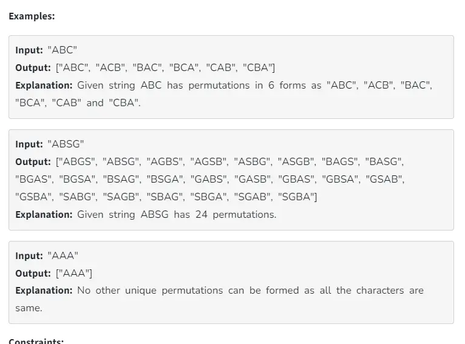

TAGS CAN BE - REVISE , IMPORTANT,
**TAGS**: #revise 
**CONCEPT:** [](.md)

https://www.geeksforgeeks.org/problems/permutations-of-a-given-string2041/1?itm_source=geeksforgeeks&itm_medium=article&itm_campaign=practice_card
## Problem Statement
> Given a string **s**. The task is to return a vector of string of all **unique** permutations of the given string, **s** that may contain duplicates in lexicographically sorted order.



## Approach / Thought Process
1. **Initial Thoughts**: 
   - Pehle toh samjh hi nahi aya 
   - But fir USE OF EXTRA STRING TO STORE THE UPCOMING PATTERNS CAN BE  A USEFUL APPROACH

2. **Approach Options**:
  - NORMAL APPROACH
  - SWAPING APROACH
  - SWAPING WITH PRUNING IN CASE OF THE SIMILAR STRINGS

3. **Chosen Solution**:
   - Swapping Doesn't Create Many extra Strings.

## Code (C++)
```cpp
// C++ solution goes here
void getpc(vector<string>&res,string &s,int i){
       
       if(i==s.size()-1){
           res.push_back(s);
           return;
       }
       unordered_set<char>set;
       for(int idx=i;idx<s.size();idx++){
           if(set.count(s[idx]))continue;  // YE HAI PRUNNING KA STEP HAI
           set.insert(s[idx]);
           swap(s[i],s[idx]);
           getpc(res,s,i+1);
           swap(s[i],s[idx]);
        }
       
    }
   
    vector<string> findPermutation(string &s) {
        // Code here there
        vector<string>res;
        getpc(res,s,0);
        return res;
        }
```

## Complexity Analysis
- **Time Complexity**: 
- **Space Complexity**: 

## Edge Cases
List any edge cases you considered, such as:
- Empty input
- Very large input
- Special cases (e.g., minimum/maximum values)

## Mistakes / Lessons Learned
Document any mistakes you made while solving, along with the solutions.
Write down any new techniques or patterns that you discovered while working on this problem.

Well now I got to know to about the use of the extra string to get the patterns out of the given string 

## Additional Resources
- **Discussion Links**: Links to relevant discussions or solutions that provide additional insights.
- **Reference Links**: Any articles, videos, or other resources that helped you understand the problem better.