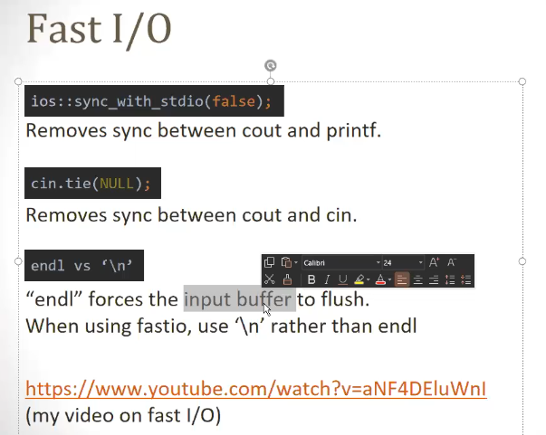

  


```C++
std::vector<int> numbers = {1, 2, 3, 4, 5};

// Using reference - can modify original elements
for (auto &num : numbers) {
    num *= 2;  // This will actually change the values in 'numbers'
}

// Without reference - only modifies copies
for (auto num : numbers) {
    num *= 2;  // This does not affect the original 'numbers' vector
}
```

→`long long x` or `long long int x` - they are interchangeable.  
  


- No negative numbers: `unsigned long long` cannot represent negative values.
- Larger positive range: It can represent twice the range of positive numbers compared to `long long`.
- Different overflow behavior: Overflow wraps around differently than with signed types.
- For `long long x`:  
      
    In decimal, this is:  
    - Minimum value: -2^63
    - Maximum value: 2^63 - 1
    - Minimum: -9,223,372,036,854,775,808
    - Maximum: 9,223,372,036,854,775,807
- For `unsigned long long x`:  
      
    In decimal, this is:  
    - Minimum value: 0
    - Maximum value: 2^64 - 1
    - Minimum: 0
    - Maximum: 18,446,744,073,709,551,615

→ALWAYS USE LONG DOUBLE for float values


# \#include<bits/stdc++.h>





  

  

```C++
\#include <bits/stdc++.h>
using namespace std;

\#define endl '\n'
\#define int long long

const int MOD = 1e9 + 7;
const int INF = LLONG_MAX/2;

signed main() {
    ios::sync_with_stdio(false);cin.tie(NULL);

    int tc; cin >> tc;
    while (tc--) {
        // Your code logic here
    }

    return 0;
}
```