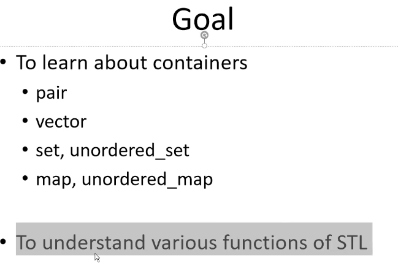

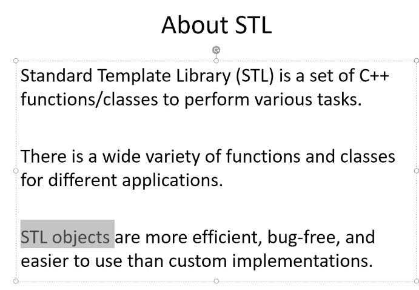

→Funtions Jaise Sort!

→Class Jaise Vectors/Unordered_map/ etc. Classes Ko containers bhi bolte hain!

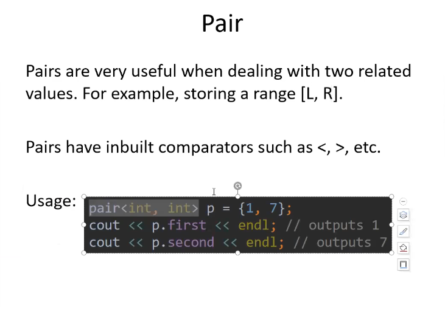

→Jabh Koi 2 Values inseperable ho toh in that case we use pair class

→ Example jaise Mujhe Time Intervals Save karni hoti hai!

→

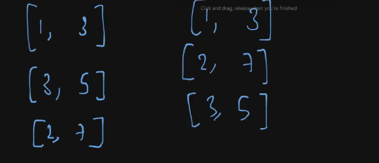

→ pairs par comparison bhi jojata hai easily meaning ki pehle first elements compare hote hain and then second vale, lexicographically comparison hota hai!// kyonki unpe comparison operator hota hai!

→

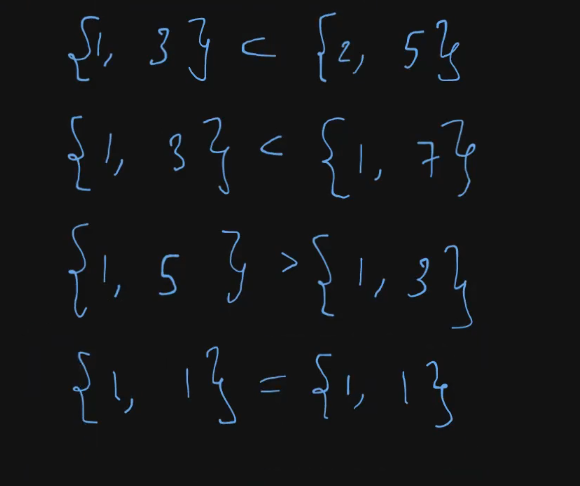

→

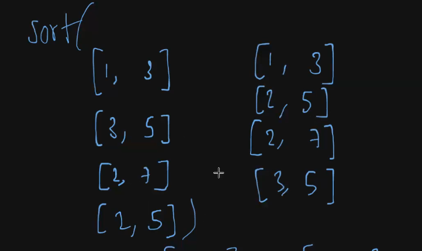

→ sort function call kar skte hain pair par!

→ Sort call kar skte hain kisi bhi container par! Whether it’s an array or vector!

  

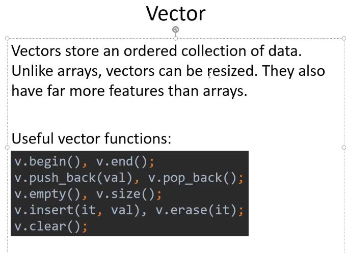

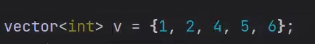

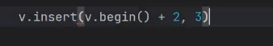

→Iterators ka use karke hum Koi value kahin bhi dal skte hain!

→ yahan 3 dalne se hum values ko aage khiska denge!

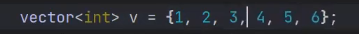

THIS IS O(N)

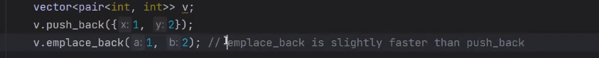

Emplace mein curly brackets nahi lagate! But safe nahi hota emplace ko fir avoid hi kar skte hain!

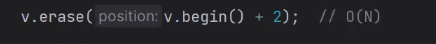

→ v.erase() Kinda deletes One element!// Size bhi kam hota hai

→v.clear() deletes the whole array!

→

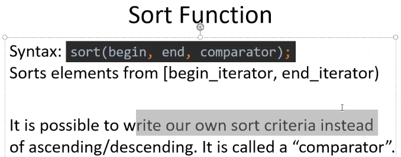

The `std::sort` function in C++'s Standard Template Library (STL) can **only be applied to random-access iterators**. This means it can be used on containers that support random-access iterators, such as:

- `std::vector`
- `std::array`
- C-style arrays (raw arrays)

// ye bhi dekh na Array and vector continous type hote hain memory k andar I guess uski vajah se we can do it!

However, it **cannot** be directly applied to containers like:

- `std::list`
- `std::set`
- `std::unordered_set`
- `std::map`
- `std::unordered_map`

These containers do not support random-access iterators, as their elements are not stored contiguously in memory, and their iterators do not allow access to elements by index.

For containers like `std::list`, you can use `std::list::sort`, which is a member function specifically designed for sorting lists. For associative containers like `std::set` and `std::map`, they maintain sorted order by their nature, so no sorting is needed.

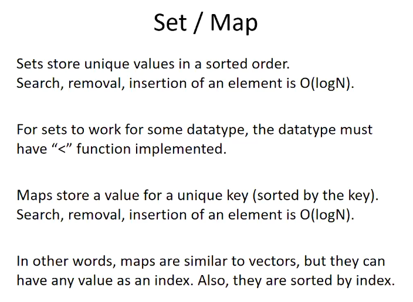

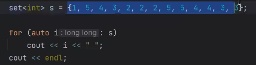

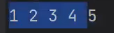

→ An ordered set will be sorted at any given point of time which means! Koi insertion / deletion k bad bhi ye map sorted rahega!

→To check if the set contains this element or not we can use contains functions on it!

- `**count**` works in all versions of C++ (starting from C++98) and returns an integer (either 0 or 1).
- `**contains**` is available starting from **C++20** and returns a boolean, making the intention clearer when checking for the presence of an element or key.

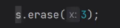

Works!

→mySet.erase(3); // Removes element 3 from the set

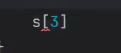

→Doesn’t work! We can’t use indexing with it!

→In case we create our own datatype then for us to use set/ map we need < function implemented // kyonki vo set / map hamesha sorted hoga na!

→

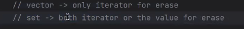

• When you use `erase` on a vector, you typically provide an iterator pointing to the element you want to remove  
• Vectors allow random access, meaning you can use arithmetic operations on iterators (like   
`+` or `-`) to navigate through the elements.  
• For sets, you can use either an iterator or a value directly. The   
`erase` function can take an iterator pointing to the element or the value of the element you want to remove.

→ To get iterators in set It’s kinda Hard!

→

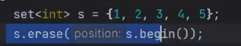

This works

→

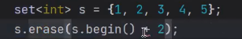

This won’t , because The + operator is not defined

→

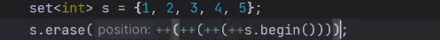

This works!

Set iterators can move only one step at a time!

→

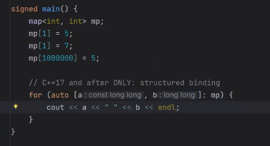

→ A map stores key value pairs on the other hand Set only stores values!

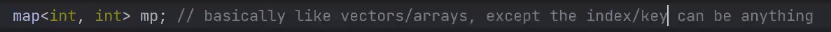

→

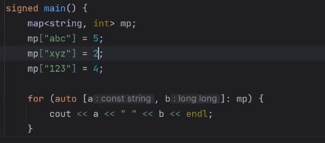

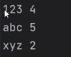

→So an array can’t have more than 1e^5 size and for a global array it’s 1e^7

→Even maps can’t have more than that!

→ So if we have a map of strings assume! Now The TC of inserting and searching will increase!  
If we have a string s of length L now TC will L*LogN  

→ The comparison of Integers happen in O(1)

→

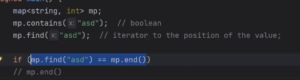

→ key important hoti hai!

→ sorting bhi key par hoti hai!

→

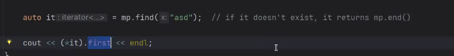

→ We can also do here it→first this will also work and the values can be modified using these!  
  

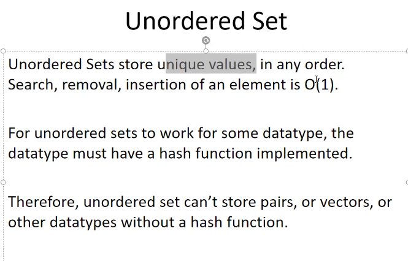

→

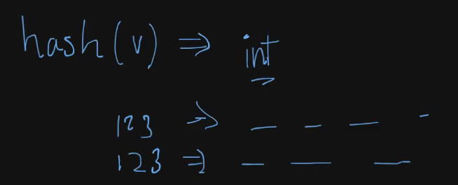

→So Basic datatypes ko toh change karna hash function ko ata hai but complex datastructures ko nahi ata bro!

→ unordered set nahi banega pair ka! but set par chl jaega easily!

→When one or values have the same Hash It’s called collision!

→ Collision Makes our Code slower! Sometimes Unordered set TC of Insertion or searching can go upto O(N)

→

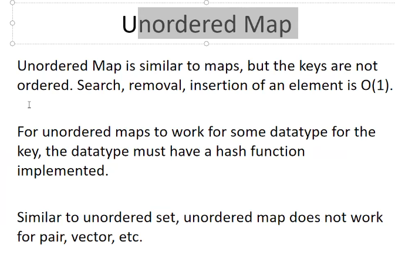

→ In an unoredered map The value Doesn’t matter, So because of that! key par restrictions hai but value jo hai na wo kuch bhi ho skti hai! Mtlb value mein pair ,vector dal skta huon but key main toh basic data type hi dal skte hain!

→

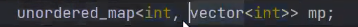

This will work

→

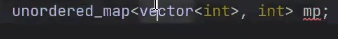

Vector can be the value but never be the key!

→

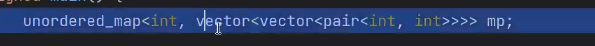

Works

→Hashability only matters in Unordered map and unordered set!

→

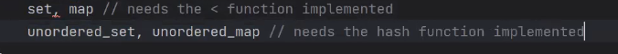

→

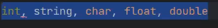

These are hashable!

→ generally it’s better to use map and set instead of using unoredered set and maps!

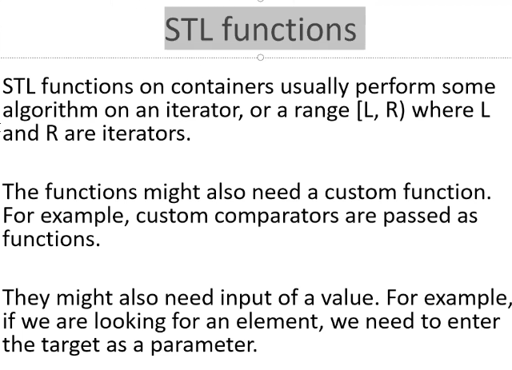

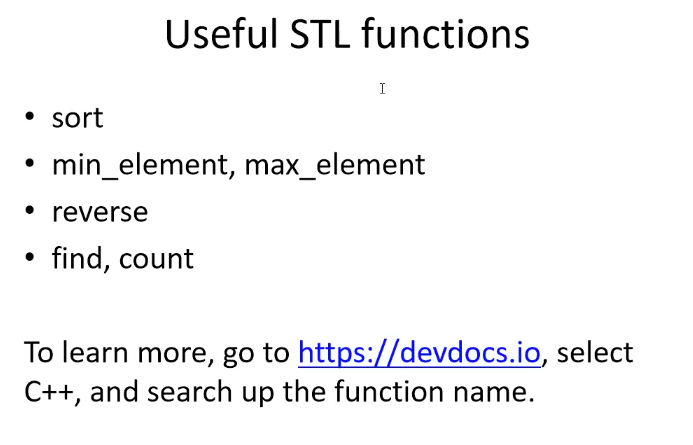

→And iterators can be used in any way!

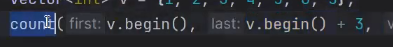

Yahan par har v.end() dalne ki jarurat nahi hai!

→ sort(v.begin(),v.begin()+4) sorts[0,4)→ index 4 is exclusive!

→Sort function in default mode sorts in ascending order!

→

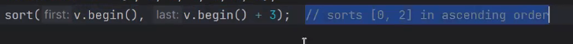

→

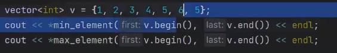

→Since function return krta hai iterator and we got it converted to the actual value by derefrencing it with *

→

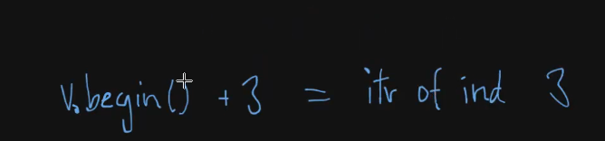

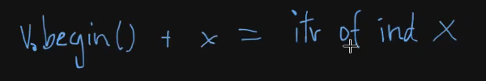

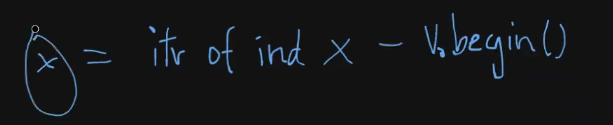

→ Now to find the indices of these elements! What we can do is

→ in a vector we can do this but not in a map!

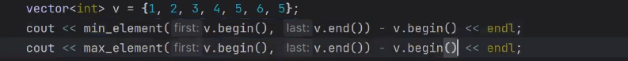

→ This type of Things can be done where the containers are continuous!

→

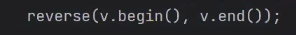

→

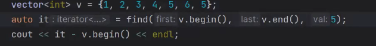

First occurrence deta hai ye!

→

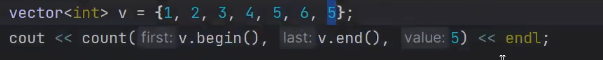