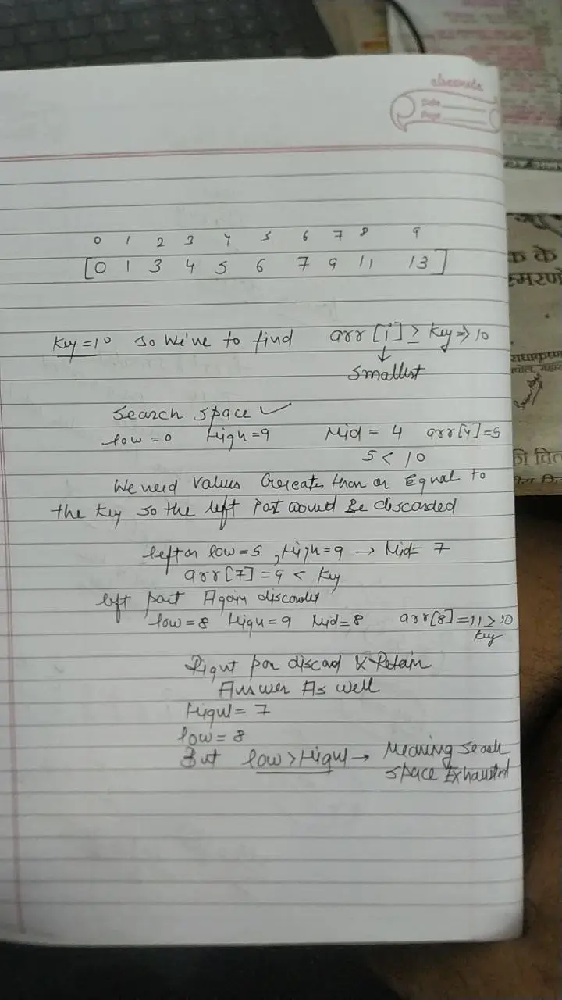

The Problem Doesn't Necessarily have to be array related! **IT CAN BE USED ANYWHERE!! WHERE THE SEARCH SPACE IS SORTED!!!** AS LONG AS THE SEARCH SPACE IS SORTED THEN WE CAN APPLY BINARY SEARCH
Think About how you search in a dictionary!!

Binary Search is an efficient algorithm used to find an element in a **sorted array**. It works by repeatedly dividing the search interval in half. If the value of the search key is **less than** the item in the middle, the search continues in the **left half**, otherwise in the **right half**.

### 🔍 How Binary Search Works

1. Start with two pointers: `low = 0` and `high = n - 1` (start and end of the array).
    
2. Calculate the middle index: `mid = low + (high - low) / 2`
    
3. Compare the middle element with the target:
    
    - If `arr[mid] == target`, return `mid`.
        
    - If `arr[mid] < target`, search in the right half: `low = mid + 1`.
        
    - If `arr[mid] > target`, search in the left half: `high = mid - 1`.
        
4. Repeat until `low > high`.

### ✅ C++ Implementation of Binary Search

**ITERATIVE** 
```c++
int binarySearch(int arr[], int n, int target) {
    int low = 0, high = n - 1;

    while (low <= high) {
        int mid = low + (high - low) / 2; // To avoid overflow

        if (arr[mid] == target)
            return mid;
        else if (arr[mid] < target)
            low = mid + 1;
        else
            high = mid - 1;
    }

    return -1; // Not found
}
```

Time Complexity: O(logN)
Space Complexity: O(1)

SO BASICALLY YAHAN PAR GAME HAI SEARCH SPACE KO ADHA KARNE KA!! AUR DIVIDE KARNE KA SINCE WITH THE HELP OF THE MONOTONUS WAY OF CHANGE IN VALUES!!
SEARCH SPACE PAR KAM KARTE HAIN HUM YAHAN!
**RECURSIVE** 

```c++
int bsRecursive(int low, int high, int target, vector<int>& nums) {
    if (low > high) return -1;

    int mid = low + (high - low) / 2; // Prevents potential overflow
    if (nums[mid] == target) return mid;

    if (nums[mid] < target)
        return bsRecursive(mid + 1, high, target, nums);
    else
        return bsRecursive(low, mid - 1, target, nums);
}

int search(vector<int>& nums, int target) {
    return bsRecursive(0, nums.size() - 1, target, nums);
}
```

Time Complexity: O(logN)
Space Complexity: O(log N)


**OVERFLOW CASE!!**
In C++, integers (`int`) have a fixed size (usually 32 bits), which means they can only represent numbers between about `-2,147,483,648` and `2,147,483,647`.

If `low` and `high` are both large integers, say close to `2,000,000,000`, then:

`low + high   // might exceed 2,147,483,647`

➡️ This causes **integer overflow**, which results in a **negative or incorrect value for `mid`**, and can break your binary search (or cause segmentation faults).

### ✅ Solution: Safe Mid Calculation

To **avoid overflow**, rewrite the calculation like this:

`int mid = low + (high - low) / 2;`

#### Why this works:

- `high - low` will not overflow because it's the difference of two values in range.
    
- Adding that to `low` keeps the result safe and within bounds.

### Implement Lower Bound

So basically in a given array with a key we've to find such index that arr[i]>Key and the minimum value of the i would be the answer!

MY APPROACH


```c++
   int lowerBound(vector<int> &nums, int x) {

        int low = 0;

        int high = nums.size()-1;

        int ans=high+1;

  

        while(low<=high){

        int mid = (low + high)/2;

        if(nums[mid]>=x){

            ans=mid;

            high=mid-1;

        }else{

           low=mid+1;

        }

        }

        return ans;

    }
```

Time Complexity: O(logN)
Space Complexity: O(1)

