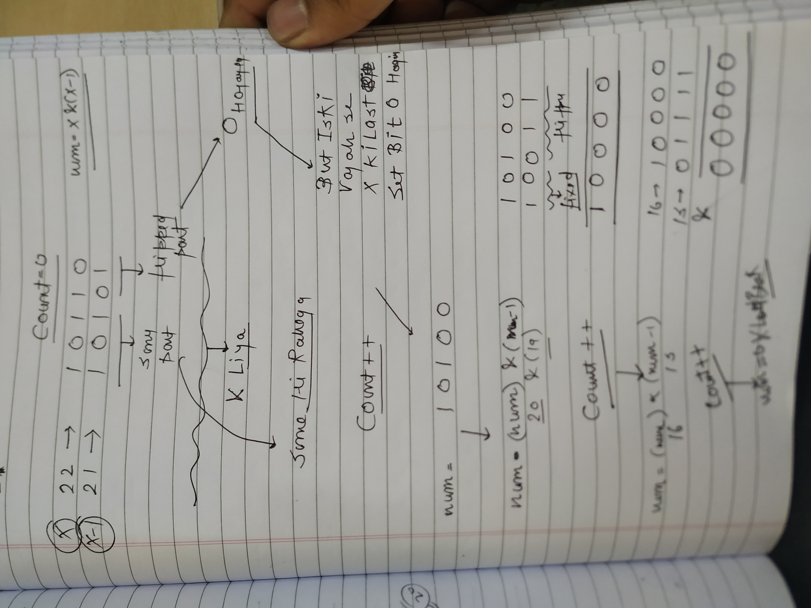
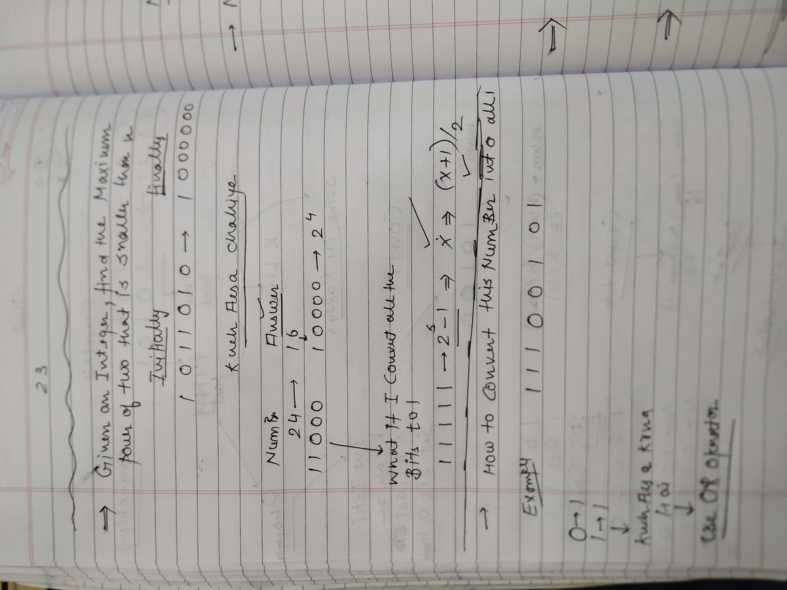
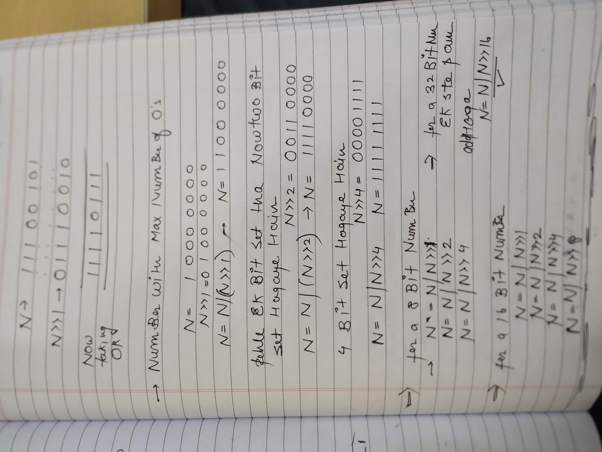
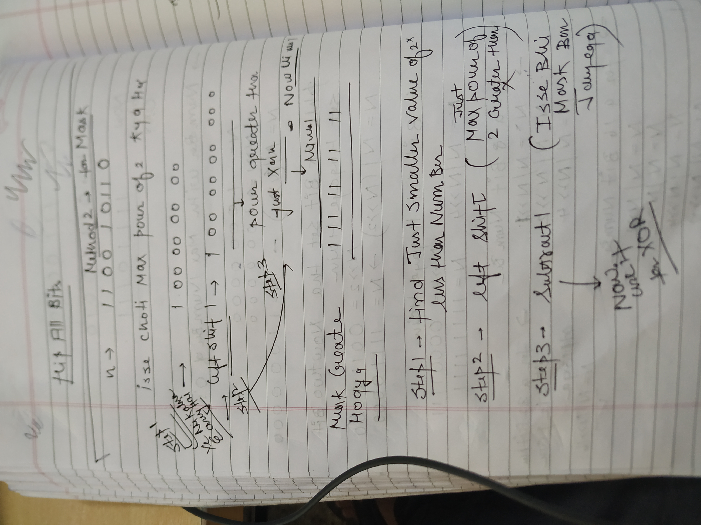
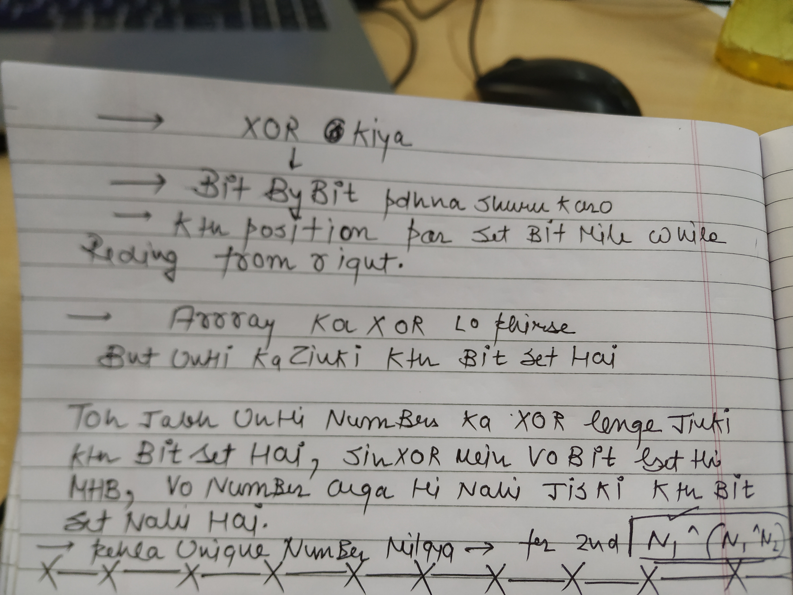
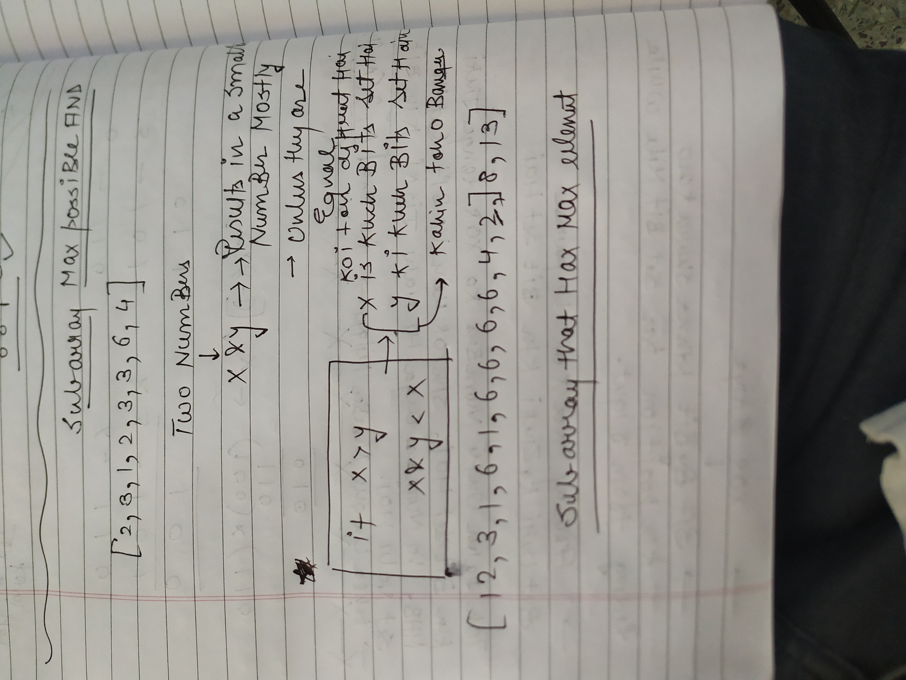

SET BITS KA MTLB HOTA HAI KI KITI BITS 1 HAI

→ IN BUILT FUNCTION HOTA HAI YE


→


→X and X+1 mein kuch part same rahega kuch part flipped rahega

→ ye flip start hoga X+1 ki last set bit se


  


  

Since jabh humne & kiya X , X-1 k bich mein

→ jo flipped wala part vo 0 hua which mean X ki last set bit bhi 0 hui

→ Ye processs karte raho jabh tak pura number 0 na ho

Utni hi iterations lagegnhi jitni set bits hain

**⇒ TO CALCULATE THE NUMBER OF SET BITS**



**Counting Set Bits (Brian Kernighan's Algorithm)**

```Plain
	public class CountSetBitsKernighan {
		public static void main(String[] args) {
			int num = 29; // Example number, 11101 in binary, has 4 set bits
			System.out.println("Number of set bits in " + num + ": " + countSetBits(num));
		}

		public static int countSetBits(int num) {
			int count = 0;
			while (num > 0) {
				num &= (num - 1); // Clear the rightmost set bit
				count++;
			}
			return count;
		}
	}
```


1st approach→ mein kya hota hai ki upar btaya hai

2nd Approach:

Ek kam kar skte given number ki msb k sath and bad mein sare elements 1 one krdete hain pehle!

Wo kaise kar sakte hain??? Well with the use of Or operator

**⇒AGAR KUCH AESA KRNA HO KI 0 HAI TOH 1 KARDO AND 1 HAI TOH BHI 1 KARDO TOH IN THAT CASE OR OPERATOR KI HELP LENA SUITABLE REHTA HAI**


  

  

  

  

  





  



→Sabko one kar diya and uske bad + add karke divide by two kar diya


[https://leetcode.com/problems/minimum-bit-flips-to-convert-number/?envType=daily-question&envId=2024-09-11](https://leetcode.com/problems/minimum-bit-flips-to-convert-number/?envType=daily-question&envId=2024-09-11)

⇒JABHI BHI HUM XOR KRTE HAIN TOH SAME SAME OFF(0) HOJATA HAI DIFFERENT WALE ON(1) HOJATE HAIN. TOH ISSE PATA LAGA JATA KITNI DIFFRENT BITS HAI BY COUNT THE SET BITS OF THE OUTPUT OF XOR.

APPROACH 1-

```C++
int minBitFlips(int start, int goal) {
        int x=start^goal;
        int count=0;
        while(x>0){
            x=x&(x-1);
            count++;
        }
        return count;
    }
```

APPROACH 2-

  


XOR IS COMMUATIVE TOO

  


→Assume tumhe koi number given hai ! Jaise 5 And tumhe And tumhe uski last but check karni hai ki wo set hai ya nahi

→5&1→ 0 bit k alawa sari bits neutralise hojaegi and last bit se pata lagega since 1 ki last bit set hoti hati and answer ki bhi last bit set hai mtlb number ki last bit set hai and otherwise for 0



  

```C++
\#include <vector>
\#include <iostream>
using namespace std;

vector<int> findTwoUnique(vector<int>& nums) {
    // Step 1: XOR all the numbers
    int xor_result = 0;
    for (int num : nums) {
        xor_result ^= num;
    }

    // Step 2: Find any set bit in xor_result (e.g., the rightmost set bit)
    int set_bit = xor_result & -xor_result;  // This isolates the rightmost set bit

    // Step 3: Partition the array into two groups and XOR within each group
    int unique1 = 0, unique2 = 0;
    for (int num : nums) {
        if (num & set_bit) {
            unique1 ^= num;  // XOR for numbers with the set bit
        } else {
            unique2 ^= num;  // XOR for numbers without the set bit
        }
    }

    return {unique1, unique2};  // Return the two unique numbers
}

int main() {
    vector<int> nums = {1, 2, 1, 3, 2, 5};
    vector<int> result = findTwoUnique(nums);

    cout << "The two unique numbers are: " << result[0] << " and " << result[1] << endl;
    return 0;
}
```





JABH SAREE MAX EK HI SUBARRAY MEIN AA JAYENGE

## **MODULAR ARITHMETIC**


⇒BUT YE NUMBER CHOTE NAHI HAI

⇒But 2 bade numbers multiply honge in that case Range bahar hojaegi int type se

⇒Small Numbers mein koi dikkat nahi hai but Big numbers mein dikkat aegi

**⇒INTEGER BUCKET OVERFLOW**


ALWAYS TRUE

FOR PRODUCT WE CAN USE THIS FORMULA


  

FOR SUBTRACTION


  


This will do the trick