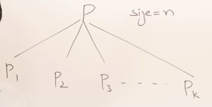
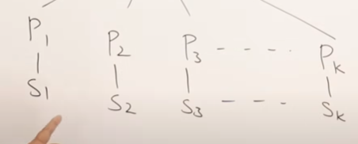
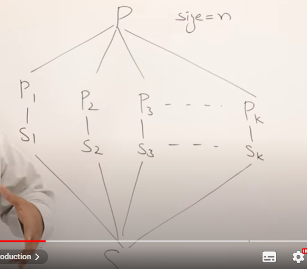
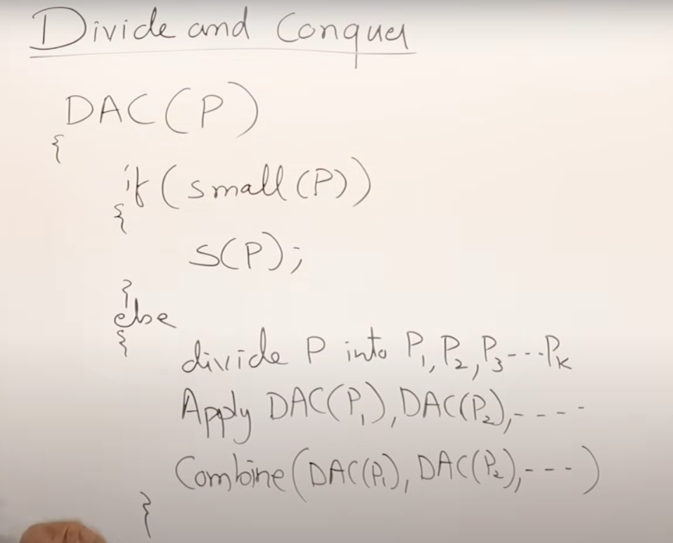
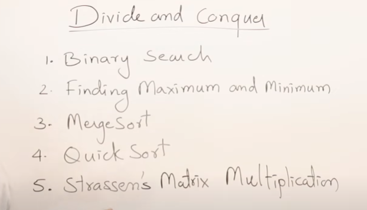

**→YE BASICALLY STRATEGY HOTI HAI**

→Assuming ke mere pass ek badi Problem and it can be broken down into smaller sub problems!

→Now These smaller subproblems we can calculate and then! Combine these solutions to get the solution of main problem!

### →THE ESSENCE OF GREEDY ALGORITHMS IS THAT THE SUBPROBLEM WILL BE OF SAME NATURE AS OF THE MAIN PROBELM

Ex→ Sorting ki choti problems bhi sorting hi karwenegei

→ ONLY THIS WAY Everything is recursive in nature!

→ After Breaking them we need some way to combine them to get the main solution

→

