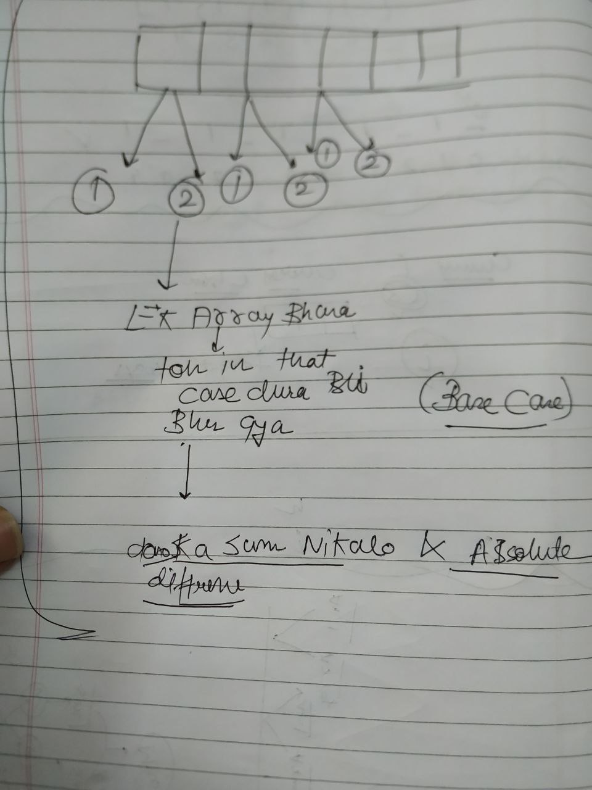

→ PATA KAISE LAGAEING? KI DP LAG RAHI HAI

→SO INCASE KAHIN AGAR MUJHE CHOICE MIL RAHI HAI, TOH THAT MIGHT LEAD TO ME CHOOSING RECURSION TO SOLVE THIS PROBLEM WHICH IN TURN WOULD HAVE SUBPROBLEMS BEING SOLVED AGAIN AND AGAIN → SO YAHAN DP LAGEGI

→ overlapping subproblems typically happen because there are multiple recursive calls that end up solving the same subproblems independently, without reusing previously computed results.

→Agar ek hi call hai toh in That case Overlapping kabhi nahi hoti

→


→Single call sirf depth mein hi jati hai

→


→


→ CHOICE→ RECURSION→ TWO CALLS → DP LAG SAKTI HAI

→ OPTIMAL SOLUTION MANG RA HAI→ IN THIS CASE ALSO DP LAG SAKTI HAI

→


→


# **PATTERN 1→ KNAPSACK**

→BASCIALLY YAHAN PAR CHOICES HAI TOH MUJHE RECURSION KA INTUTION DETI HAI

→ KISI ITEM KO CHOR SAKTA HUON KISI ITEM KO PICK KAR SAKTA HUON

→ AUR KUCH CONDITION HOGI IN PICKED UP SUBSET OPTIONS PAR

→ EXAMPLE JAISE KI PICKED UP ITEMS KA SUM MAX HO BUT YA KOI AUR CONDITION HO

Q→[https://www.geeksforgeeks.org/problems/0-1-knapsack-problem0945/1](https://www.geeksforgeeks.org/problems/0-1-knapsack-problem0945/1)

  
  

```C++
  vector<vector<int>>dp;
    int help(int W, vector<int>& wt, vector<int>& val,int i){
        if(i>wt.size()-1)return 0;// YAHAN INT_MIN KAB RETURN KARNA HAI YA 0 dhyan rakhn
        if(W<0)return INT_MIN;
        if(W==0)return 0;
        if(dp[W][i]!=-1)return dp[W][i];
        
        
        int pickvalue=INT_MIN;
        if(wt[i]<=W) pickvalue=val[i]+help(W-wt[i],wt,val,i+1);
        int letvalue= help(W,wt,val,i+1);
        if(pickvalue==INT_MIN&&letvalue==0)return dp[W][i]=0;
        return dp[W][i]=max(pickvalue,letvalue);
    }
    
     int knapSack(int W, vector<int>& wt, vector<int>& val) {
        // Your code here
      dp.resize(1002,vector<int>(wt.size()+2,-1));//dp represnt karta hai ki iss amount
        return help(W,wt,val,0);// par and is index par max sumvalue kitni ho skti hai
        
        
    }
    -------------------------------------
        // Function to return max value that can be put in knapsack of capacity W.
    int help(int W, vector<int>& wt, vector<int>& val,int i){
        if(i>wt.size()-1)return 0;
        if(W<0)return INT_MIN;
        if(W==0)return 0;
        
        
        int pickvalue=INT_MIN;
        if(wt[i]<=W) pickvalue=val[i]+help(W-wt[i],wt,val,i+1);
        int letvalue= help(W,wt,val,i+1);
        if(pickvalue==INT_MIN&&letvalue==0)return 0;
        return max(pickvalue,letvalue);
    }
    
     int knapSack(int W, vector<int>& wt, vector<int>& val) {
        // Your code here
        return help(W,wt,val,0);
        
        
    }
    
    
    
    
```


→Fractional knapsack mein Greedy lgti hai

→Bottom up approach→


→BASE CONDTION OF THE RECURSIVE SOLUTION WILL BE COVERTED INTO INTIALISATION

**AB PATA KAISE LAGEGA KI KNAPSACK WALA PATTERN PUCH RAHE HAIN??**


AESE KUCH CHOICES KA PATTERN BANE THEN SAMAJH JAO→ KNAPSACK HAI

Q2→[https://www.geeksforgeeks.org/problems/subset-sum-problem-1611555638/1?itm_source=geeksforgeeks&itm_medium=article&itm_campaign=practice_card](https://www.geeksforgeeks.org/problems/subset-sum-problem-1611555638/1?itm_source=geeksforgeeks&itm_medium=article&itm_campaign=practice_card)

```C++
  vector<vector<int>>dp;
   bool help(vector<int>&arr, int sum,int i){
       if(sum==0)return true; // ye pehle check karo because kisi jagah items and sum dono
       if(i>arr.size()-1||sum<0)return false;// sath mein khtam hue toh wahan mera code false de deta agar order of checks ulta hota toh
       if(dp[sum][i]!=-1)return dp[sum][i];
   
       
       bool inc=false;
       if(arr[i]<=sum)inc=help(arr,sum-arr[i],i+1);
       bool let=help(arr,sum,i+1);
       return dp[sum][i]=(inc||let);
       
       
   }
   
   
   
       bool isSubsetSum(vector<int>arr, int sum){
        // code here 
        dp.resize(sum+1,vector<int>(arr.size()+1,-1));
        int i=0;
        return help(arr,sum,i);
      }
```

Q3→[https://leetcode.com/problems/partition-equal-subset-sum/description/](https://leetcode.com/problems/partition-equal-subset-sum/description/)

```C++
  vector<vector<int>>dp;
    bool help(vector<int>&nums,int sum,int i){
     if(sum==0)return true;
     if(sum<0||i>nums.size()-1)return false;
     if(dp[sum][i]!=-1)return dp[sum][i];
     bool picks=false;
     if(nums[i]<=sum)picks=help(nums,sum-nums[i],i+1);
     bool lets=help(nums,sum,i+1);
     return dp[sum][i]=(picks||lets);
    }
    bool canPartition(vector<int>& nums) {
        int sum=0;
        for(int i=0;i<nums.size();i++){
            sum+=nums[i];
            }
        if(sum%2!=0)return false;
        dp.clear();
        dp.resize(sum+2,vector<int>(nums.size()+2,-1));
        return help(nums,sum/2,0);
        }
```

Q4→[https://www.geeksforgeeks.org/problems/perfect-sum-problem5633/1](https://www.geeksforgeeks.org/problems/perfect-sum-problem5633/1)

  

```C++
   const int MOD = 1e9 + 7;
   vector<vector<int>>dp;
	int help(int arr[],int sum, int n,int i){
    if(i==n){
        if(sum==0){
            return 1;
        }else{
            return 0;
        }
    }  // har subset k liye pura array traverse karne k bad check hoga

    if(dp[i][sum]!=-1)return dp[i][sum];
    int keepi=0;
    if(arr[i]<=sum) keepi=help(arr,sum-arr[i],n,i+1);
    int leti= help(arr,sum,n,i+1);
    return dp[i][sum] = (keepi + leti) % MOD;
    }

int perfectSum(int arr[], int n, int sum)
{
    // Your code goes here
    dp.clear();
    dp.resize(n+5,vector<int>(sum+4,-1));
    return help(arr,sum,n,0);

}
```

  

  

Q5→[https://leetcode.com/problems/partition-array-into-two-arrays-to-minimize-sum-difference/description/](https://leetcode.com/problems/partition-array-into-two-arrays-to-minimize-sum-difference/description/)(REVISE)



  

  

Q6→[https://www.geeksforgeeks.org/problems/partitions-with-given-difference/1](https://www.geeksforgeeks.org/problems/partitions-with-given-difference/1)

  

  

  

Q7→[https://leetcode.com/problems/target-sum/description/](https://leetcode.com/problems/target-sum/description/)

```C++
class Solution {
public:
    vector<vector<int>>dp;
    int help(vector<int>& nums, int target,int i,int cs){
    if(i==nums.size()){
        if(cs==target){
            return 1;
        }else{
            return 0;
        }

    }
    int css=cs+2000; // Shift cs by 2000 to avoid negative indices// YE MAT BHULNA
        
        // Check if the subproblem is already solved
        if(dp[i][css] != -1) {
            return dp[i][css];
        }
      int nump=help(nums,target,i+1,cs+nums[i]);
      int numn=help(nums,target,i+1,cs-nums[i]);
     
      return dp[i][css]=nump+numn;  // if cs<0 then what do we need to do
 }
    int findTargetSumWays(vector<int>& nums, int target) {
        
        dp.clear();
        int sum=0;
        dp.resize(25,vector<int>(4001,-1));
        return help(nums,target,0,0);
        
    }
};
```

  

  

  

  

# **PATTERN 2→ UN BOUNDED KNAPSACK**

TOH DIFFERENCE KYA HAI BOUNDED AUR UNBOUNDED K BICH MEIN WELL?


→**0-1 Knapsack** mein choice hoti hai har element par ki isko lena hai ki nahi lena hai and uss choice k bad hum uss particular index se aage badh jate hain while on the other hand **UNBOUNDED KNAPSACK** mein ye hota hai uss index k element ko hum fir se le skte hain.

→Multiple occurrences of a same element is allowed

→1→ 01 knapsack// Unbounded knapsack


  

  

Q0→[https://www.geeksforgeeks.org/problems/knapsack-with-duplicate-items4201/1?itm_source=geeksforgeeks&itm_medium=article&itm_campaign=practice_card](https://www.geeksforgeeks.org/problems/knapsack-with-duplicate-items4201/1?itm_source=geeksforgeeks&itm_medium=article&itm_campaign=practice_card)

  

Q1→[https://www.geeksforgeeks.org/problems/rod-cutting0840/1?itm_source=geeksforgeeks&itm_medium=article&itm_campaign=practice_card](https://www.geeksforgeeks.org/problems/rod-cutting0840/1?itm_source=geeksforgeeks&itm_medium=article&itm_campaign=practice_card)

  

Q2→[https://leetcode.com/problems/coin-change-ii/description/](https://leetcode.com/problems/coin-change-ii/description/)(MAX WAYS)

```C++
class Solution {
public:
    vector<vector<int>>dp;
    int help(int amount, vector<int>& coins,int i){
    if(amount==0)return 1;
    if(amount<0||i>=coins.size())return 0;
    if(dp[amount][i]!=-1)return dp[amount][i];

    int letcw=help(amount,coins,i+1);
    int scw=0;
    if(coins[i]<=amount){
        scw=help(amount-coins[i],coins,i);
    }
    return dp[amount][i]=letcw+scw;


    }
      int change(int amount, vector<int>& coins) {
        dp.clear();
        dp.resize(5005,vector<int>(305,-1));
        
        return help(amount,coins,0);
        
    }
};
```

  

Q3→[https://leetcode.com/problems/coin-change/description/](https://leetcode.com/problems/coin-change/description/)(MIN COINS)(REVISE)