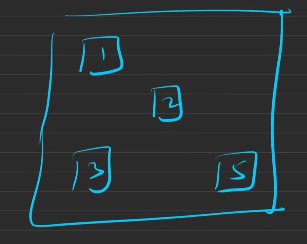

# WHAT’S WRONG WITH ARRAY IN THE FIRST PLACE???WELL

**→An array is of fixed size. We can’t increase and decrease the size// WELL ON THE OTHERHAND LINKEDLIST CAN BE INCREASED AND DECREASED NO BIG DEAL**
**→Array is Stored in a contagious location**


## **SINGLY LINKED LIST**
**-LL is not in a contagious location**
. (HEAP MEMORY)


**-Nodes can be anywhere**
**-Size can be increased and decreased at any time**
**-In array, we have an index since it’s contagious but in LL we can’t do that.**
**-So we traverse the array using the index but what can we do in the linked list??**
-**Since in every Node we keep a pointer of type node named next which holds the address of the next node**
**-Since most of the LL is made dynamically, everything is in the heap memory**


**IN THE LAST NODE OF THE LINKED LIST , IT WILL BE POINTING TOWARDS NULL**
##### How to add eLement to a LL??
- Since we are not dependent on the next memory location it’s easy to add an element in a LL, Just make a new tail and the old tail next should be pointing to this new tail and new tail next should be pointing towards null!
- To delete an element just delete it
- Tail k next mein null hi hoga
### Where is LL is used?
→In stack and queue DS. Since they are flexible in size
→Even in browsers!


DOUBLY LINKED LIST HAI YE BROWSER MEIN
**ASSUME KAHIN TUJHE 2/3/4 Depending upon the need variables ki jarurat pad rahi hai in that case WAHAN SELF DEFINED DATATYPE KAM KAREGA PKKA**
Struct Node→ Instead of Struct always use class, CLASS offers you OOPS// YE TRIKA USING STRUCT SAHI NAHI HAI LEKIN


**MAKE A CLASS IT IS MUCH BETTER,SINCE IT COMES WITH OOPS CONCEPTS**
**JABH BHI SELF DEFINED DATA STRUCRURES KA USE KRNA HO USE CLASS CONCEPT**


### MEMORY SPACE ALLOCATED

Memory allocation→ Depends upon the system


### TRAVERSAL in LL

We can create all the links in the LL while traversing it.
**We’ll get the head, Don’t ever hamper it! NEVER EVER TEMPER WITH THE HEAD and DON’T FORGET IT**
IN LINKED LIST QUESTIONS HUMEIN HEAD RETURN KARNA PADTA HAI

**Length of LL can be found using traversal. Just traverse the LL and keep a counter.**

Time complexity of the These:


### Questions

### ⇒Delete the head


```C++
//Better code
Node * deleteHead(Node *head) {
 if(head==NULL)  return head;// Main ye bhul jata huon
   Node*temp=head;
   head=head->next;
   delete temp;
   return head;
}
```

**⇒Delete the tail**

```C++
// mera code // stopping at the 2nd last element(main concept)
Node *deleteLast(Node *list){
    // Write your code here
    // ye kar sakta huon ki traverse kar luon aur 2nd last par ruk jauon
    if(list==NULL||list->next==NULL)  return NULL;
      // but in the case where only one node Is present i didn't delete it i just updated the head
    
    Node*temp=list;
    // AB SURELY ATLEAST 2 NODES TOH HONGE HI!
    //ye tarika acha hai counter assumption see edge case pata lag jate hain
    // Prev and current ka use bhi kar skte hain
    while(temp->next->next!=NULL){
        temp=temp->next;
    }
    //Node*tail=temp->next;
    delete temp->next;
    temp->next=NULL;
    return list;
}
```

**⇒Delete The kTh element of a LL(revise)**

→In **LL problems build the code from the edge cases not, Don’t try to think of the algorithm.**
→This question is a perfect example of where to use **PREV and CUR pointers**

```C++
Node* deleteNode(Node* head, int x) {
        if(head==NULL)return NULL;
        int count=1;
        Node *temp=head;
        Node *prev=NULL;
        if(x==1){
            head=head->next;
            delete temp;
            return head;
        }
        while(temp){
            if(count==x){
                prev->next=temp->next; // SINCE THE ONLY PROBLEM THAT COULD COME HERE IS THAT TEMP MIGHT GET NULL BUT TABH LOOP CHLEGA HI NAHI NA BHAI!
                temp->next=NULL;
                delete temp;
                break;
                }
                prev=temp;
                temp=temp->next;
                count++;
                 }
               return head;
    }
```

**⇒Delete the node with a specific value**


→now it will remove the first node with value el now just can just use recursion for if we want to delete all the nodes with the value el,

---

**OBSERAVTION ABOUT DELETION IS THAT⇒ MUJHE DELETE KRNE K LIYE KOI CERTAIN ELEMENT AND USKE PICHE WALE ELEMENT KI JARURAT PAD RAHI HAI AND ALSO USKE LIKE MUJHE TWO POINTERS RAKHNE PAD RAHE HAIN → TEMP,PREV**

---

  

**⇒Insert Element at the head!**

```C++
// This is correct but we can use the constructor better
Node* insertAtFirst(Node* list, int newValue) {
    // Write your code here
    Node* temp=new Node(newValue);
    temp->next=list;
    return temp;
}
// this is better in case constructor ko use karna ho
Node* insertAtFirst(Node* list, int newValue) {
    // Write your code here
    return new Node(newValue,list);
     
}
```

⇒Insert Element at the end

```C++
//mera chutiya code
Node* insertEnd(Node* head, int k) {
    // Write your code here.
    Node *tail=new Node(k);
    Node*temp=head;
    if(head==NULL){
        return tail;
    }
    while(temp->next!=NULL){ // logic yehi hai 
      temp=temp->next;
    }
    temp->next=tail;
    return head;


}
```


  

⇒**STARTING WALA EDGE CASE MAT BHULNA BHAI LINKED LIST MEIN,SAWAL KO BUILD UP VAHIN SE KARNA HOTA HAI**

**⇒Insert node at any position**

// MTLB KUCH AESA SA HI KARNA HAI

```C++
Node * insert(Node * head, int n, int pos, int val) {
    // Write your code here
 if(head==NULL)return head;

 if(pos==0){
     Node*nhead=new Node(val);
     nhead->next=head;
     return nhead;
     }

Node*temp=head;
Node*prev=NULL;
int cp=0;

while(temp!=NULL){
if(cp==pos){
    Node*nn=new Node(val);
    prev->next=nn;
    nn->next=temp;
    break;


}
cp++;
prev=temp;
temp=temp->next;
}
if(temp==NULL&&cp==pos){
    Node*tail=new Node(val);
    prev->next=tail;

}
return head;
}
```

**⇒Insert Before a Node with value X**

```C++
Node* insertBeforeValue(Node* head, int x, int val){
    // Write your code here.
    if(head==NULL)return NULL;

    if(head->data==val){
        Node*n=new Node(x);
        n->next=head;
        return n;       // yahan sirf is case mein panag hota
    }
    Node*temp=head;
    Node*prev=NULL;
    while(temp!=NULL){

    if(temp->data==val){
        break;
    }
    prev=temp;
    temp=temp->next;
     } 
    Node*n=new Node(x);
    prev->next=n;
    n->next=temp;
    return head;

}
```

DIRECTION OF TARVERSAL IN LINKEDLIST IS ONLY FORWARD .

In a **singly linked list**, you cannot directly traverse **backward** because each node only contains a reference to the **next** node, not the previous one.

Workarounds to Traverse Backward:

**1.Reverse the list temporarily**:  
  
**2.Use Recursion**:

- A recursive approach can be used to simulate backward traversal. You first move forward through the list recursively and then print each node’s value when returning from the recursive call (thus effectively moving backward).

**Example (in pseudocode)**:

```Plain
pseudo
Copy code
function printReverse(node):
    if node is null:
        return
    printReverse(node.next)
    print node.data

```

**3.Use a Stack**:

- You can push each node onto a stack as you traverse the list. Since a stack is Last In First Out (LIFO), when you pop nodes off the stack, they will be in reverse order.

  

## Doubly linked list!

**→HERE WE CAN GO IN BOTH DIRECTIONS!**

→Since in Singly LL The only direction is forward. but in doubly linked list direction can be both the sides.


**→A node is pointing forward as well as backward**


→Just add a back pointer in Node class of single LL


→We’ll have a head too here

→SO BASICALLY YAHAN DO LINK HOTE HAIN KINHI BHI TWO NODES K BICH MEIN BASS WO MAT BHULNA SINCE KOI BHI OPERATION HOGA TOH IN THAT CASE KUCH BONDS TUTENGE AND KUCH JUDENGE.MTLB KAM ASAN KAR DEGA BUT JARURI NAHI HAI

**Introduction To Doubly Linked List**

YAHAN TOH PREVIOUS POINTER KA USE OBVIOUS HI HAI

### Questions

→Convert arr into a doubly Linked List

```C++
Node* constructDLL(vector<int>& arr) {
    // Write your code here
    Node*head=new Node(arr[0]);
    Node*pr=head;
  for(int i=1;i<arr.size();i++){
    Node*temp=new Node(arr[i]);
    pr->next=temp;
    temp->prev=pr;
    pr=temp;
   }
  return head;
}
```

  

**Delete Head of a Doubly Linked List**

```C++
Node * deleteHead(Node *head) {
    // Write your code here.
    if(head==NULL||head->next==NULL)return NULL;
    // SABSE BADI GHALTI YE KI HAI MAINE KI NEW HEAD KE PREV KO NULL NAHI KIYA
    Node*temp=head->next;
    temp->prev=NULL;// ye bhul gaya that main
    head->next=NULL;
    delete head;
    return temp;
}// you need the segregate the node you want to delete 
```


// better way to write this code


// pehle edge case socho in LL

  

**Delete the Last Node of a Doubly Linked List**

```C++
Node * deleteLastNode(Node *head) {
    // Write your code here
 if(head==NULL||head->next==NULL)return NULL;

 Node*temp=head;
// main directly last element par gya huon
 while(temp->next!=NULL){
     temp=temp->next;
 }
temp->prev->next=NULL;// this should be done pehle
temp->prev=NULL; // order of these two is the main concept here 
delete temp;
return head;
}
```


  

**Delete K-th Node from Doubly Linked List**

My Code

```C++
 Node* deleteNode(Node* head, int x) {
        // Your code here
       if(x==1){
           head=head->next;
           head->prev=NULL;
           return head;
         }
       Node*temp=head;
       int count=1;
       while(temp!=NULL){
           if(count==x)break;
           temp=temp->next;
           count++;
       }
       temp->prev->next=temp->next;
       if(temp->next==NULL){
           temp->prev=NULL;  // ye wale edge cases jo hote hain na ya toh start mein list k
       }else{                // ya end mein ayenge LL K
           temp->next->prev=temp->prev;
       }
       delete(temp);
       return head;
      
     }
```

  

striver code→

```C++
Node* removeKthElement(Node* head, int k){
    if(head==NULL){
        return NULL;
    }
    int count = 0;
// ye directly kth node par chla gaya hai
    Node* kNode = head;
    while(kNode!=NULL){
        count++;
        if(count==k){
            break;
        }
        kNode = kNode->next;
    }
// use of prev and front pointers
    Node* prev = kNode->back;
    Node* front = kNode->next;
    
    if(prev==NULL && front == NULL){
        delete kNode;
        return NULL;
    }
    else if (prev==NULL){
        return deleteHead(head);
    }
    else if(front == NULL){
        return deleteTail(head);
    }
    
    prev->next = front;
    front->back = prev;
    
    kNode->next = NULL;
    kNode->back = NULL;
    
    delete kNode;
    
    return head;
}

```

**Delete node from Doubly Linked List**

```C++
void deleteNode(Node* node) {
    //Write your code here.
    Node*p=node->prev;
    Node*f=node->next;
    p->next=f;
    if(f!=NULL) f->prev=p;// ye case hai tail k liye kyonki tail ka next null hai toh null ka preious kuch nahi hoga
    node->next=NULL;
    node->prev=NULL;
    delete node;
    }
```

**Insert At The Front of a Doubly Linked List**

```C++
Node* insertAtFront(Node *head, int k) {
    // Write your code here.
    Node*temp=new Node(k);
    if(head==NULL)return temp;
    temp->next=head;
    head->prev=temp;
    return temp;

}
```

**Insert before the Kth node**

```C++
Node* insert(Node *head, int k, int val) {
    // Write Your Code Here.
    if(k==1){
        Node*n=new Node(val); // so over time ye realize hua ki pehle question mein
        n->next=head;  // jo tail k sath problem hui vo yahan head k sath hui
        head->prev=n; // koi null element ki property ko main cher data huon 
        return n;// null ka koi next nahi hoga nahi koi prev hoga
    }

Node*temp=head;
int count=1;
while(temp!=NULL){
if(k==count)break;
temp=temp->next;
count++;
}
Node*p=temp->prev;
Node*n=new Node(val);
p->next=n;
temp->prev=n;
n->prev=p;
n->next=temp;
return head;
}
```

Q→[https://leetcode.com/problems/delete-node-in-a-linked-list/description/](https://leetcode.com/problems/delete-node-in-a-linked-list/description/)(REVISE)

APPROACH 1 ⇒ SWAP VALUES

```C++
 void deleteNode(ListNode* node) {
      ListNode*cur=node->next;
      ListNode*prev=node;
        while(cur->next){
        int temp=cur->val;
        cur->val=prev->val;
        prev->val=temp;
        prev=cur;
        cur=cur->next;
        }
        int temp=cur->val;
        cur->val=prev->val;
        prev->val=temp;
        prev->next=NULL;


 }
```

APPROACH 2⇒

```C++
  void deleteNode(ListNode* node) {
      ListNode*cur=node->next;
      node->val=cur->val;
      node->next=cur->next;
      delete(cur);

 }
```

APPROACH 3⇒

```C++
void deleteNode(ListNode* node) {
        *(node)=*(node->next);
        }
```

  

  

CHLO AB BAT KRTE HAIN COMMMON ERRORS KI MERE CODE MEIN

MOSTLY WO NULL POINTER ACESS KRNE SE HI AA RAHE HAIN BHAI

TOH MAIN KYON NAHI START KARTA SOLUTION BUILD UP KARNA EDGE CONDITIONS SE

  

**Two pointers (**`**prev**` **and** `**current**`**)** are needed for both **insertion** and **deletion** to properly adjust links in the list. MTLB EK SE HI BHI KAM HOJAYEGA BUT TWO POINTERS SE ASANI SE HOJATA HAI