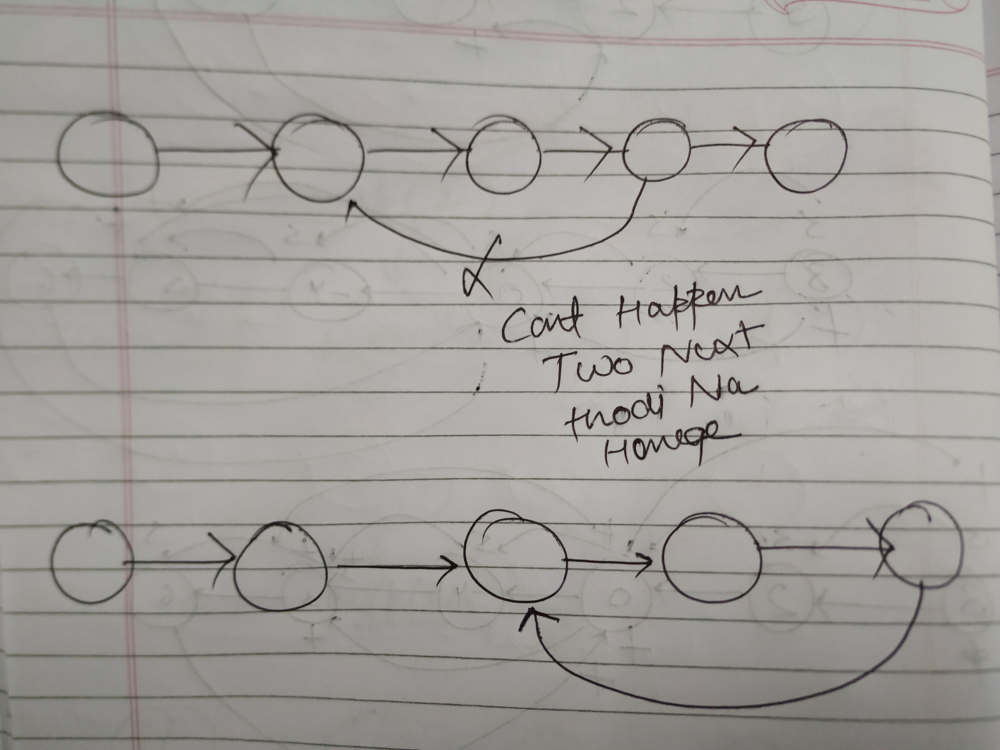
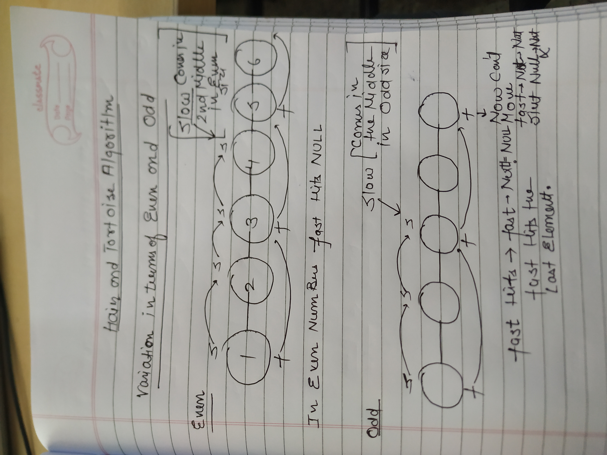

→SWAPPING AS A CHOICE REHTI HAI BHAI LINKED LIST MEIN

→ LINKED LIST ALSO GIVES AN OPTION TO USE PREVIOUS BASIC PROBLEMS

QUESTIONS

### [https://www.geeksforgeeks.org/problems/reverse-a-doubly-linked-list/1](https://www.geeksforgeeks.org/problems/reverse-a-doubly-linked-list/1)(REVISE)

```C++
DLLNode* reverseDLL(DLLNode* head) {
    if (head == NULL || head->next == NULL) return head;

    DLLNode* temp = head;
    DLLNode* newHead = NULL; 
    
    while (temp != NULL) {
        DLLNode* nextNode = temp->next;
        temp->next = temp->prev;
        temp->prev = nextNode;
        
        newHead = temp;
        
        temp = nextNode;
    }

    return newHead;
}
```

  

  

## Tortoise Hare Method

**Remember this pattern for problems that require middle finding in a Linked List.**

[https://leetcode.com/problems/middle-of-the-linked-list/](https://leetcode.com/problems/middle-of-the-linked-list/)

BRUTE FORCE

```C++
ListNode* middleNode(ListNode* head) {
       int count=0;
       ListNode*temp=head;
       while(temp!=NULL){
        count++;
        temp=temp->next;
       }
       int l=(count/2)+1;
       count=1;
       temp=head;
       while(temp!=NULL){
        if(count==l){
            break;
        }
        count++;
        temp=temp->next;
       }
       return temp;

        
    }
```


OPTIMISED APPROACH(Tortoise Hare Method)

**⇒VARIATION OF SPEED OF POINTERS CAN ALSO BE HELPFUL SOMETIMES**

BUT REMEMBER WHEN DOING HARE AND TORTOISE APPROACH ALWAYS FAST K LIYE 2 CONDTIONS ATI HAI YE YAD RAKHNA.SINCE FAST DO PLACES CHLTA HAI AND IN SIZE OF EVEN AND ODD IT ENDS UP IN DIFFERENT PLACES IN THE LINKEDLIST WHILE TRAVERSING. SO ISLIYE 2 CONDITIONS USE KARNI HOTI HAI FAST PAR

```C++
ListNode* middleNode(ListNode* head) {

        ListNode* fast = head;
        ListNode* slow = fast;

        while (fast && fast->next) {  // ye condition main kaffi bar bhul jata huon
            slow = slow->next;
            fast = fast->next->next;
        }

        return slow;
    }
```

INTUTION:

⇒Number of moves by fast will always be twice of moves by the slow pointer

TC: O(N/2)

  

  

## REVERSE A LINKEDLIST

[https://leetcode.com/problems/reverse-linked-list/description/](https://leetcode.com/problems/reverse-linked-list/description/)


⇒This is a naive approach since we’re just replacing the values in the nodes

RECURSIVE→ YE APPROACH MAIN BHUL JATA HUON

TC→O(N)

SC→O(N)

```C++
ListNode*help(ListNode*Node){
    if(Node==NULL||Node->next==NULL)return Node;
    ListNode*newHead=help(Node->next);
    ListNode*front=Node->next;
    front->next=Node;
    //Node->next->next=Node; //YE BHI LIKH SAKTE HAIN 
    Node->next=NULL;
    return newHead;
      }
  ListNode* reverseList(ListNode* head) {
      return help(head);
    }
```


ITERATIVE WITH STACK BUT SC→ O(N) ACHA NAHI HAI YE

```C++
 ListNode* reverseList(ListNode* head) {
        if(head==NULL)return head;
        stack<ListNode*>st;
        ListNode*temp=head;
        while(temp!=NULL){
            st.push(temp);
            temp=temp->next;
        }
        ListNode*nh=st.top();
        temp=nh;
        st.pop();
        while(!st.empty()){
            temp->next=st.top();
            temp=st.top();
            st.pop();
        }
        temp->next=NULL;
        return nh;
   }
```

ITERATIVE → O(1) SPACE AND O(N) TIME

**USING OF THREE VARIABLES**

YEHI BEST APPROACH HAI KAFFI BAR DUSRE SAWALO MEIN USE HOTI HAI SO ISLIYE USE IT

```C++
 ListNode* reverseList(ListNode* head) {
        if(head==NULL||head->next==NULL)return head;
        ListNode*temp=head;
        ListNode*prev=NULL;
        while(temp!=NULL){
            ListNode*Nextnode=temp->next; // ye isliye kiya kyonku jaise hi temp ke next
            temp->next=prev;    // ki value yad nahi hogi toh puri list hi udd jaegi
            prev=temp;          // usko rakhne k liye humein ye karna padegi bakki
            temp=Nextnode;     // list kahin save rakhunga
        }
        return prev;  // since temp toh NULL Hojayega and fir prev usse ek pehle rahega
    }
```

  

  

## CYCLE IN A LINKED LIST

[https://leetcode.com/problems/linked-list-cycle/](https://leetcode.com/problems/linked-list-cycle/)

IF THERE IS A MINIMUM OF ONE NODE WHERE I CAN START AND REACH BACK THEN WE’RE PRETTY SURE THAT THERE EXISTS A CYCLE IN THE LINKED LIST


→So If we start from 3 to 9 any of those nodes will lead us back to it eventually

→ But if we started from 1,2 then We will never reach back to em. So that’s why i said if there is **MINIMUM of one node from where i can reach back to it again then there exists a cycle.**


  

**TRACK RAKHLO NO JO NODE VISIT HUE HAI UNKA!**

KAISE RAKHENGE ???? WELL THAT’S WHY WE’LL USE MAP HERE

```C++
bool hasCycle(ListNode *head) {
        unordered_map<ListNode*,bool>mp; // yahan pura node store kiya hai not just value
        ListNode*temp=head;
        while(temp!=NULL){
           if(mp[temp]){
            return true;
           }
           mp[temp]=true;
           temp=temp->next;
        }
        return false;
         }
```

**Time Complexity: O(N * 2 * log(N) )**

  

  

  

MY CODE→

```C++
bool hasCycle(ListNode *head) {
        if(head==NULL||head->next==NULL)return false;  // ye aese conditons mein order ghalat check karta huon kai bar
        ListNode*slow=head;  /// pehle check kar ki head null hai kya fir check kar head ka next null hai kya
        ListNode*fast=head;
        while(fast!=NULL&&fast->next!=NULL){
            fast=fast->next->next;
            slow=slow->next;
            if(slow==fast)return true;
        }
        return false;
    }
```

⇒AGAR KISI LL MEIN LOOP BNEGA TOH USMEIN NULL TOH NAHI HI AEGA SINCE



**Intuition→The key insight here is the relative speed between these pointers. The fast pointer, moving at double the speed of the slow one, closes the gap between them by one node in every iteration. This means that with each step, the distance decreases by one node.**

**Time Complexity: O(N)**

**Space Complexity : O(1)** 

  

[https://leetcode.com/problems/linked-list-cycle-ii/](https://leetcode.com/problems/linked-list-cycle-ii/)(REVISE)(PHIR SE KARNA HAI YE)

Given the `head` of a linked list, return _the node where the cycle begins. If there is no cycle, return_ `null`.

  

BRUTE FORCE

HASMAP→ JAHAN SABSE PEHLE BAR KOI ALREADY VISITED NODE MILEGA SLOW KO USS POINR PAR Cycle start hui Hogi

  

BETTER APPROACH→

```C++
 ListNode *detectCycle(ListNode *head) {
        if(head==NULL||head->next==NULL)return NULL;
        ListNode*slow=head;
        ListNode*fast=head;
         while(fast!=NULL&&fast->next!=NULL){
            slow=slow->next;
            fast=fast->next->next;
            if(slow==fast){
                slow=head;
                while(slow!=fast){
                    slow=slow->next;
                    fast=fast->next;
                                 }
                return slow;
                  }
            }
      return NULL;
    }
```

  
→YE HARE AND TORTOISE THODI SI BAKCHOD HAI DHYAN RAKHNA  

→SO KAI BAR SAWALO MEIN HARE AND TORTOISE LAG RAHI HAI

→AND IN THE STARTING CONDTIONS JO BHI IF MEIN LIKHTA HUON USKA ORDER DHYAN RAKHNA

MTLB KI HEAD! =NULL SE PEHLE HEAD→ NEXT ! = NULL MAT CHECK KRNE LAG JANA

NULL KA KUCH NEXT NAHI HOTA BHAI

  
  



