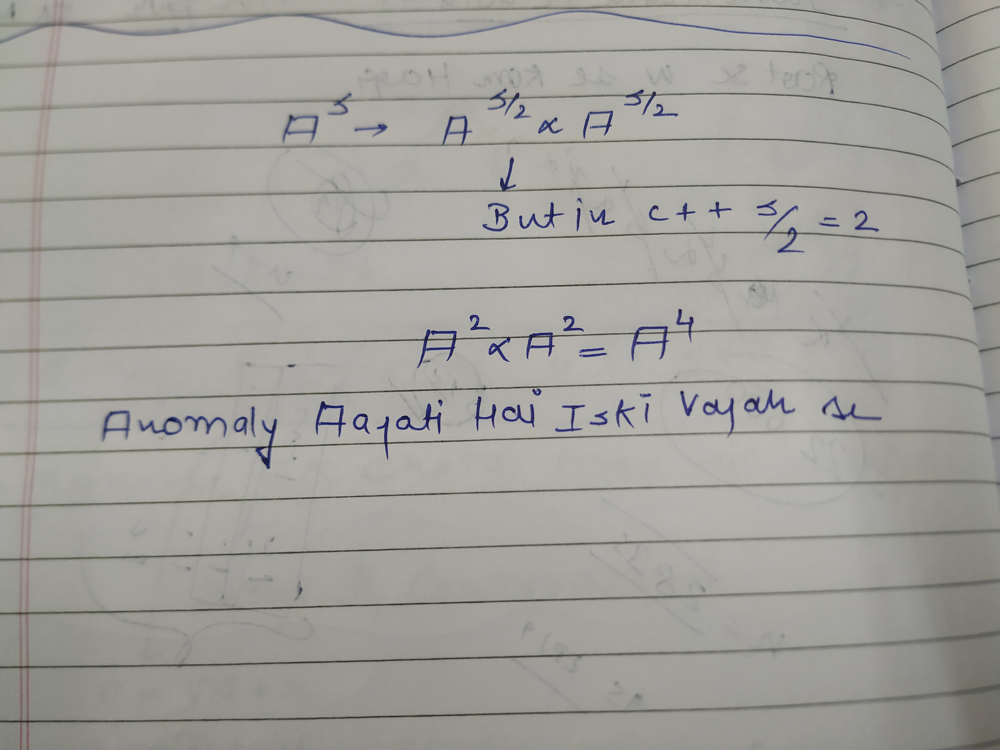

WHY THE pow(a,b) sucks!

The key points regarding the power function in C++ and why it may be considered suboptimal, particularly `std::pow`:

### Key Points:

1. **Precision Issues**:
    - `std::pow` operates on floating-point numbers (`double`), leading to potential precision errors, especially with large or small values.
2. **Performance**:
    - The function is computationally intensive due to overhead from handling floating-point arithmetic, making it less efficient for simple power calculations.
3. **Integer Power Calculations**:
    - When calculating powers of integers, `std::pow` converts integers to `double`, which can result in precision loss.
4. **Lack of Specialized Functions**:
    - C++ lacks built-in integer power functions, forcing reliance on `std::pow` even when it's not ideal.
5. **Alternative Integer Power Function**:
    - For integer powers, implementing a custom function using exponentiation by squaring is recommended for efficiency and accuracy.

KYON KIYA WELL?

Divide between two integers in C++ is always an integer and and because of that problem ati hai!

  

TOH HUM KHUD KA POWER FUNCTION BNAENGE AB

ARE KYA BAT HAI SOURAV SAHI JA RAHE HO!

YAHAN FLOOR VALUE LENE HOTI HAI B/2 ki

This will work!

Tc→ O(log N)

STL KA POWER FUNCTION CHUTIYA HOTA HAI

Ye niche wala code chutiya hai

Isko TC O(N) kyonki subproblems are getting caluclated again and again!

  

---

## MOUDLAR ARITHMETIC WITH BINARY EXPONENTIATION

→Agar Number jada bada hojata hai in that case mujhe Modular Arithmetic ki yahan bhi help leni padegi

  

  

→const int Mod aese likhne se kaffi fast hojata hai

→

→ SO WHEN THE NUMBER IS BIG WE’RE USING THE Modular Arithmentic in Binary Exponentiation

→AND