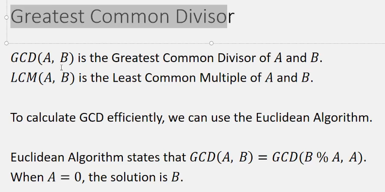

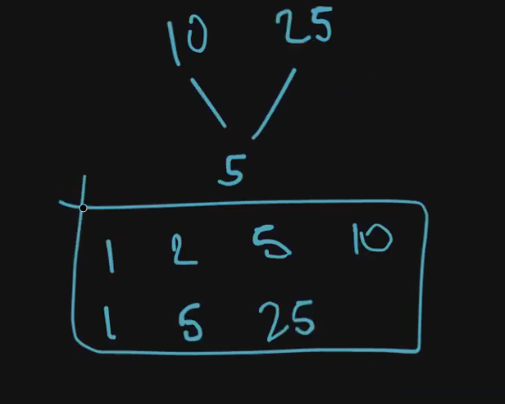

→Bachpan mein toh main Nikal leta tha Divisors dono k and then unmein se commmon le leta tha greatest wala

→THIS METHOD IS VERY SLOW IF THE NUMBERS ARE BIG

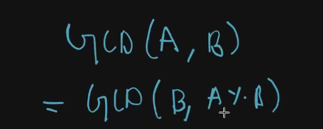

THIS IS ALSO RECURSION

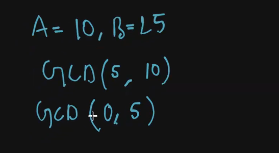

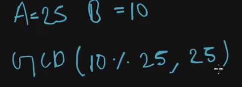

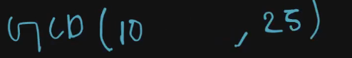

REVERSE HOKAR APNE APP FIRST PROBLEM JAISA BAN GAYA

CODE

```C++
int gcd(int a, int b) {
        if(a==0)return b;
        return gcd(b%a,a);
    }
```

  

STL BHI HAI

gcd(a,b) or __gcd(a,b)

Kaafi fast hota hai ye!

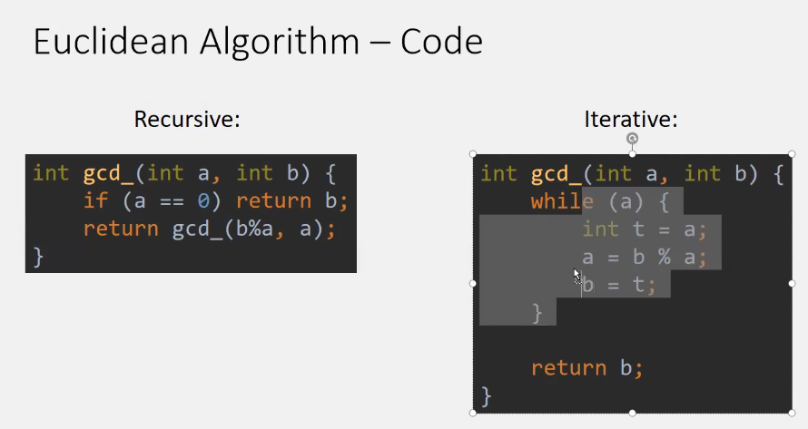

TIME COMPLEXITY OF THIS O(logN) base 2 hai yahan!

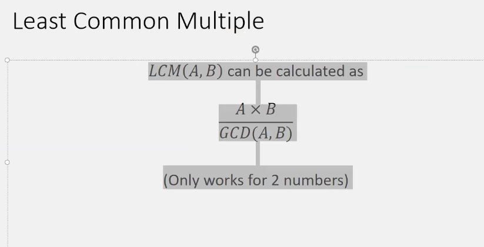

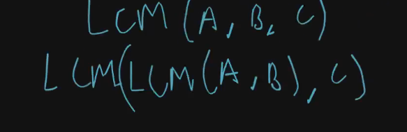

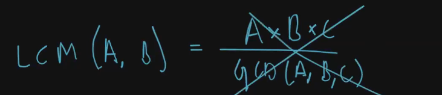

THIS WON’T WORK

GCD OF TWO NUMBERS

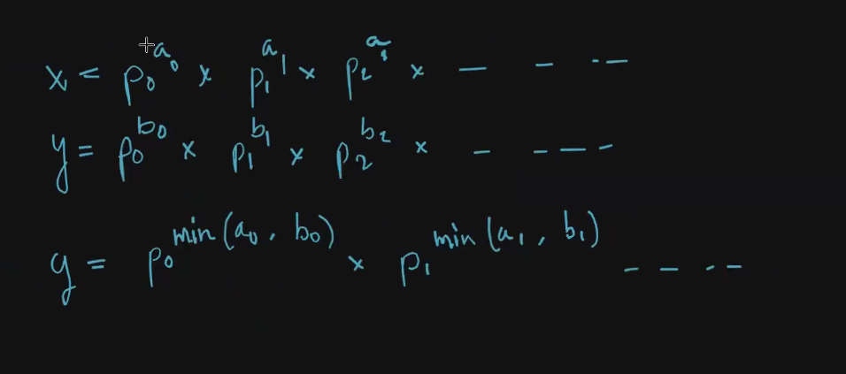

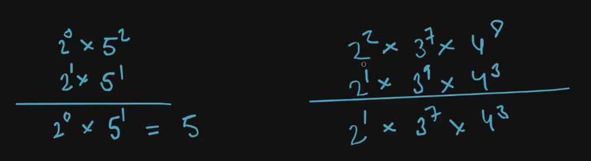

Explanation is that ki Jo kam wali powers hongi na wo badi wali ko divide kar skti hai na!

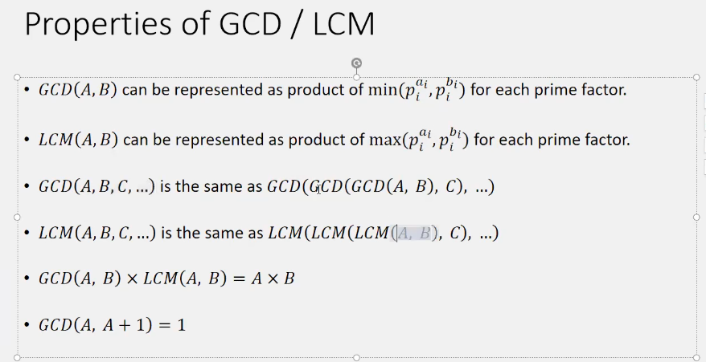