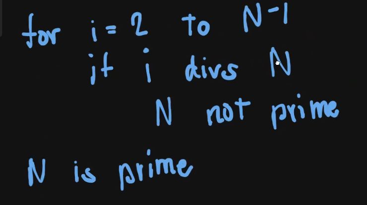
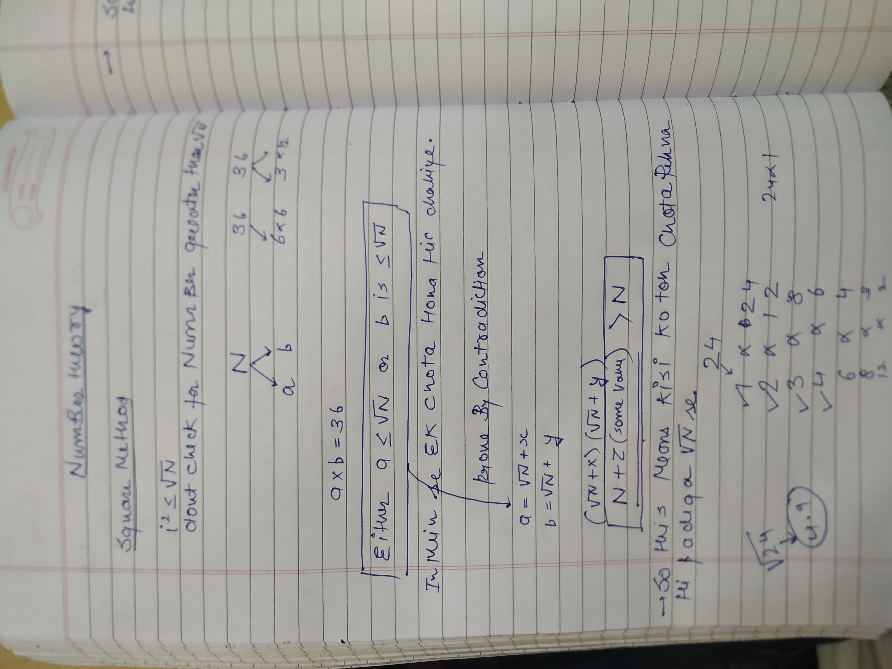
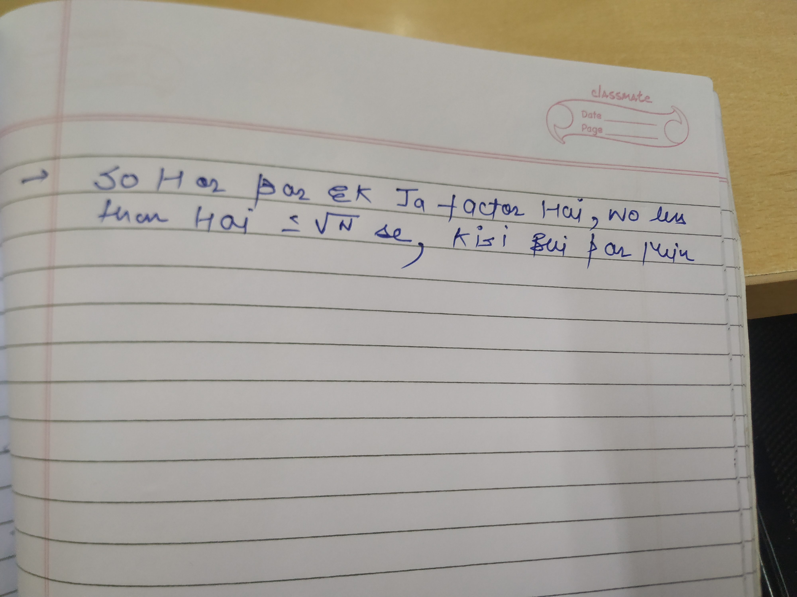
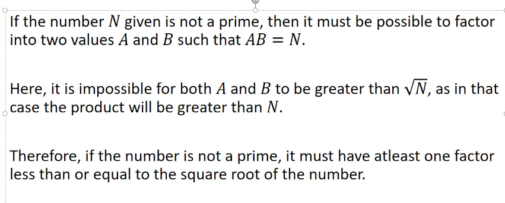
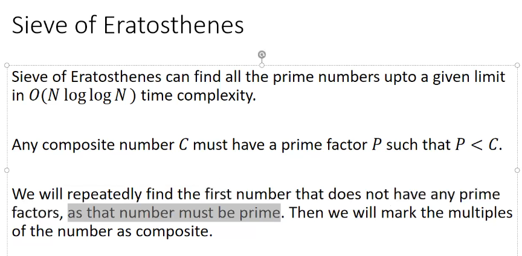
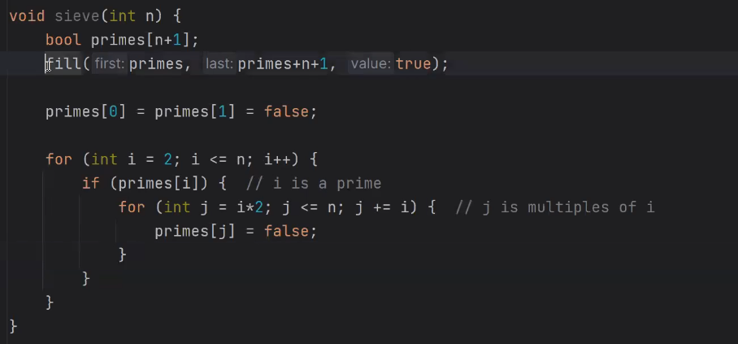
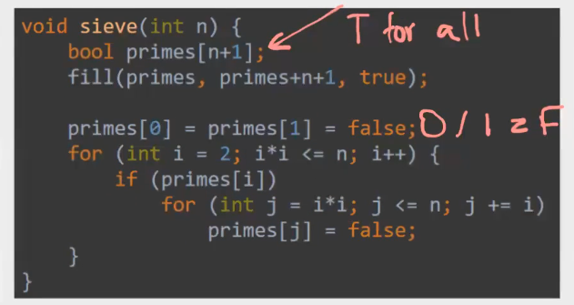
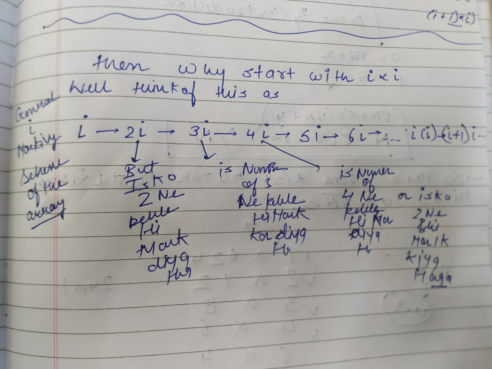
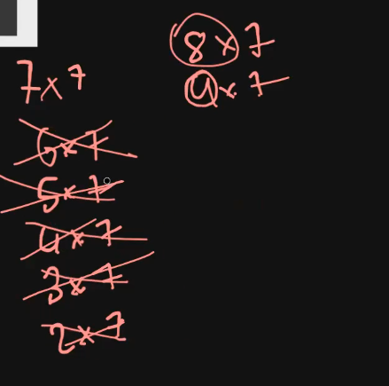
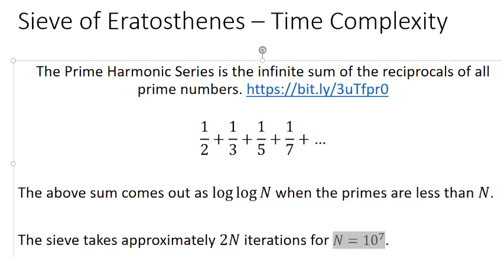

**Basic Primality Testing**

Primality testing is the process of determining whether a given number is a prime number.

**A prime number is a natural number greater than 1 that has no positive divisors other than 1 and itself.** There are several methods for primality testing, each with varying efficiency and complexity

→1 is Not Prime Number

→Yes, 2 is a prime number. It is the smallest prime number and the only even prime number, as its only positive divisors are 1 and 2 itself.

→If it's even and greater than 2, it's not prime.

## Brute Force

Assuming mujhe ek number diya hai! Like N

So for N to be a prime number uske Divisor sirf 1 and N hi hone chahiye!

Ex→ N=50



```C++
  int isPrime(int N){
        // code here
        for(int i=2;i<N;i++){
            if(N%i==0)return false;
        }
       // if(N<=1)return false;
        //return true;
        return N>1;
    }
```

→YE O(N) HOTA HAI

## SQUARE ROOT METHOD

→To check primality of a number we check it’s factors right??

→2→ N-1 Tak koi bhi factor aaya mtlb prime nahi hai toh in that way

→ jabh bhi prime factortization kiya ek number hamesha root N se kam aya among all the factors

→ toh sare number kyon check karne bass root N tak ki check kar mtlb usii chote number par focus karo!







TC→ O(root n)

## Sieve of Eratosthenes



  
The  
**Sieve of Eratosthenes** is a way to find all prime numbers up to a given limit (let's say `n`), efficiently.  
  
  

- Imagine you have a list of numbers from 2 to `n`. These are all the numbers you're testing.
- Start with the first number, `2`. Since 2 is prime, keep it. Then, mark all multiples of 2 (like 4, 6, 8, etc.) as not prime because they have a factor of 2.
- Move to the next unmarked number, which is `3`. Since it's unmarked, it's prime. Now mark all multiples of 3 (like 6, 9, 12, etc.) as not prime.
- Repeat this process for the next unmarked number (which will be prime), and mark all its multiples as not prime.
- Continue this process up to √n. Any number left unmarked by the end is prime.

---

SIDE THEORY:

### Prime Factorization

Every composite number can be expressed as a product of prime numbers in a unique way (ignoring the order). This is known as the **Fundamental Theorem of Arithmetic**.

For example:

- **12** is a composite number. Its prime factorization is:  
    12=2×2×3  
    
    12=2×2×312 = 2 \times 2 \times 3
    
- **30** is a composite number. Its prime factorization is:  
    30=2×3×5  
    
    30=2×3×530 = 2 \times 3 \times 5
    

Prime numbers are the "building blocks" of all numbers, meaning any composite number is essentially made up of prime numbers multiplied together.

HOW TO INITIALZE AN ARRAY OR VECTOR

```C++
FILL HI BETTER HAI 
vector<bool> isPrime(n + 1, true);
fill(isPrime.begin(), isPrime.end(), true);
int arr[5];  // Array of size 5
fill(arr, arr + 5, 42);  // Fills the array with the value 42
```

  

---

BACK TO SIEVE→



  

BUT IS CODE MEIN HAI BAKCHODE i≤N?? WHY ARE WE DOING IT





→i*i kisi ne thodi na mark kiya hoga





SIEVE TC→ O(NloglogN) which is juts equivalent to O(N)