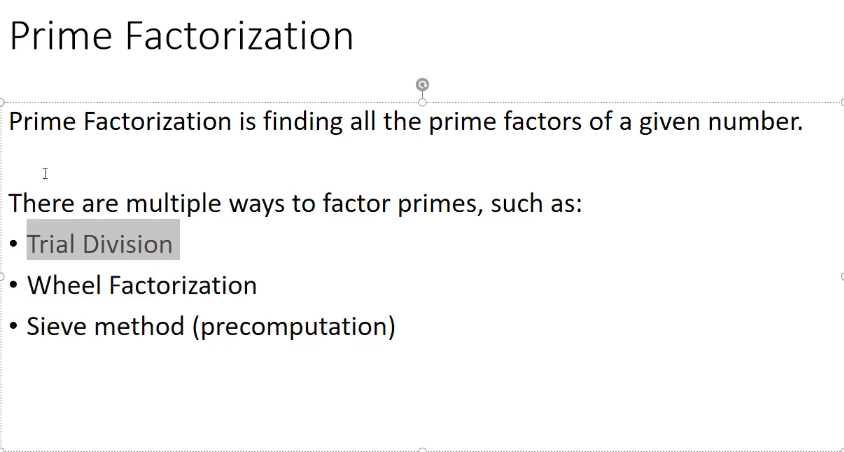
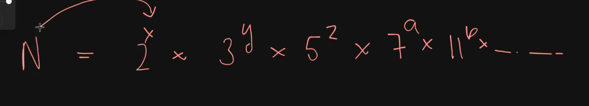
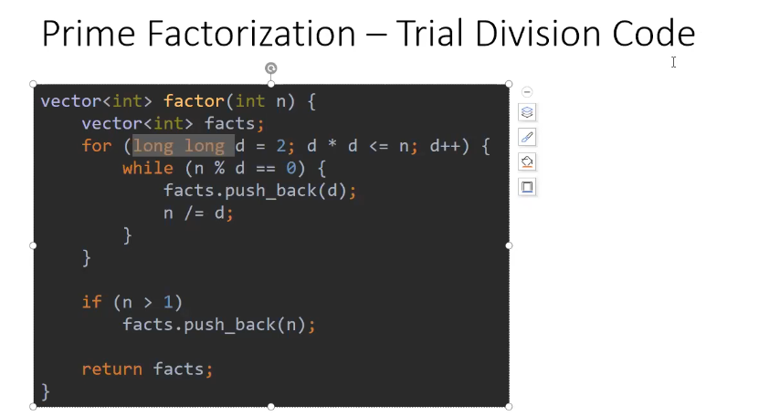

The smallest divisor of any integer greater than 1 is always a prime number.

→ ANY COMPOSITE NUMBER CAN BE REPRESENTED LIKE THIS

→In case we need to find the Structure it in terms of powers and numbers we can use map to store the power with the specific number