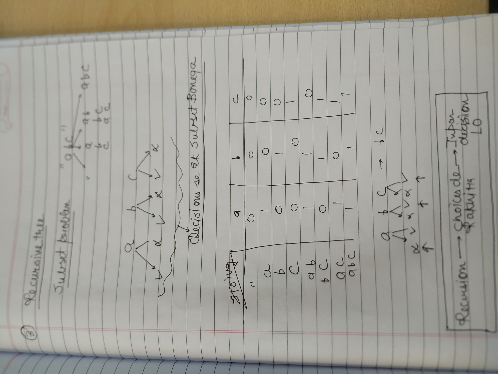

**→RECURSION KO IDENTIFY KAISE KARENEGE**

→JABH BHI CHOICES AND DECISION KI BATEIN Ho rahi huon in that case recursion lagega hi lagega


→ String Choti hori hai decisons lene par!

→ TO BUILD A RECURSIVE TREE


  


---


# **Hypothesis-Induction-Base Condition**

→In case It is really hard to Build the recursive tree or Even visualize it for complex inputs! Then we use this Hypothesis!

### 1. **Base Condition (Base Case)**

- **What it is**: The simplest case of the problem, where the recursion should stop.
- **Why it's important**: Without a proper base case, recursion would continue indefinitely, leading to a stack overflow or infinite loop. The base case ensures that the function eventually terminates.

```C++
int factorial(int n) {
    if (n == 0) return 1;  // Base case: factorial of 0 is 1
    return n * factorial(n - 1);
}
```

### 2. **Recursion Hypothesis (Recursive Step)**

- **What it is**: The assumption that the recursive function will correctly solve the problem for smaller inputs.
- **Why it's important**: When writing recursive code, you assume that the recursive call correctly solves the subproblem (smaller version of the problem). You don't need to explicitly figure out how it works for all cases; instead, you just trust that recursion works for smaller inputs (as long as the base case and induction logic are correct).

```C++
int factorial(int n) {
    if (n == 0) return 1;  // Base case
    return n * factorial(n - 1);  // Recursion Hypothesis: factorial(n - 1) works
}
```

### 3. **Induction (Combining the Result)**

- **What it is**: Using the result of the recursive call (the smaller problem) to solve the original problem. It's the step where you combine the smaller problem's solution with the current problem.
- **Why it's important**: Once the recursion hypothesis is assumed to be true, you use it to build the final solution for the larger input.

```C++
cpp
Copy code
int factorial(int n) {
    if (n == 0) return 1;  // Base case
    return n * factorial(n - 1);  // Inductive step: combining smaller result with n
}
```

### General Template for Recursive Thinking

When thinking recursively:

1. **Identify the Base Case**: What’s the simplest version of the problem?

Smallest valid input

1. **Recursion Hypothesis**: Assume your function works for smaller [subproblems](http://subproblems.YE). Ye Mostly Jo call hoti hai na subproblem wali wo step hota hai ye!
2. **Inductive Step**: Combine the solution of the smaller subproblem to solve the current problem. YAHAN IS JAGAH CODE KRNA PADTA HAI

By structuring your recursive functions this way, you can ensure they are both correct and efficient.


→Lag sab problems mein recursion hi raha hoga but Problem solve krne mein nazariya help karega for sure.

→ PEHLE IBH KA SOCHO FIR RECURSIVE TREE KA THEN FIR CHOICE DIAGRAM KA

→ In the **code structure** rather than the proof reasoning, recursive calls can sometimes appear before or after the logic handling the base or result-building, but the inductive reasoning stays the same behind the scenes.  
  
→ Jo code hum induction step mein krte usi par sab kuch depend karta hai ki recursion kaise chlega  

[https://leetcode.com/problems/maximum-depth-of-binary-tree/solutions/34207/my-code-of-c-depth-first-search-and-breadth-first-search/](https://leetcode.com/problems/maximum-depth-of-binary-tree/solutions/34207/my-code-of-c-depth-first-search-and-breadth-first-search/)

KITNA TAGDA EXAMPLE HAI IBH KA

```C++
int maxDepth(TreeNode* root) {
        if(root==NULL)return 0;
        return 1+max(maxDepth(root->left),maxDepth(root->right));
     }
```

→Hypothesis mein Tum Kuch bhi kar sakte ho!!!

→ Hypothesis mein pehla step ye hota hai ki manna! Ki ye function ye kar dega and then Step2 mein karwa do on a smal input!


→Recursion problems mein pehle socho ki kuch decisions le para huon kya main!

→ agar nahi toh fir main sochunga about IBH/ input small krne ka

→ PEHLE SOCHO DECISIONS KYA LENE HAIN

→JO CODE HUM INDUCTION MEIN LIKHTE HAIN NA VOHI HMARE HYPOTEHSIS KA KAM KAREVAEGA

  

### **[https://www.geeksforgeeks.org/problems/sort-a-stack/1](https://www.geeksforgeeks.org/problems/sort-a-stack/1)**

USING RECURSION

```C++
void SortedStack::insertSorted(std::stack<int>& s, int temp) {
    if (s.empty() || s.top() <= temp) { // Base condition
        s.push(temp);
        return;
    }
    int l = s.top();
    s.pop();
    insertSorted(s, temp); // Recursive call
    s.push(l); // Restore the previous element
}

void SortedStack::sort() {
    if (s.empty()) return; // Base condition
    int temp = s.top();
    s.pop();
    sort(); // Recursive call
    insertSorted(s, temp); // Insert the element in sorted order
}
```

  

[https://www.geeksforgeeks.org/problems/delete-middle-element-of-a-stack/1](https://www.geeksforgeeks.org/problems/delete-middle-element-of-a-stack/1)

```C++
  public:
    // Function to delete middle element of a stack.
    void deleteMid(stack<int>& s, int sizeOfStack) {
        // code here..
        if(s.size()==(sizeOfStack+1)/2){
            s.pop();
            return;
        }
        int top=s.top();
        s.pop();
        deleteMid(s,sizeOfStack);
        s.push(top);
    }
};
```

  

[https://www.geeksforgeeks.org/problems/reverse-a-stack/1?itm_source=geeksforgeeks&itm_medium=article&itm_campaign=practice_card](https://www.geeksforgeeks.org/problems/reverse-a-stack/1?itm_source=geeksforgeeks&itm_medium=article&itm_campaign=practice_card)

USING RECURSION

```C++
void insert(stack<int>&st,int temp){
       if(st.empty()){
           st.push(temp);
           return;
       }
       int top=st.top();st.pop();
       insert(st,temp);
       st.push(top);
   } 
    
    
    
    
    
    
    
    
    void Reverse(stack<int> &st){
        if(st.size()==1)return;
        int top=st.top();
        st.pop();
        Reverse(st);
        insert(st,top);
    }
```