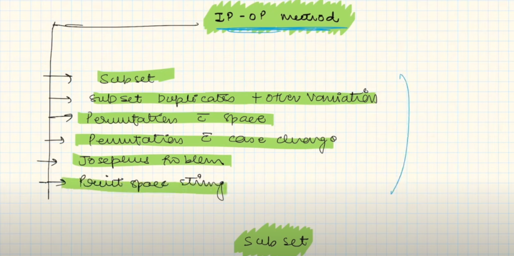

Now We will talk about Input and Output Method!

[https://www.naukri.com/code360/problems/subsequences-of-string_985087](https://www.naukri.com/code360/problems/subsequences-of-string_985087)

  

WRONG CODE→

→IN RECURSION WE NEED TO EXPLORE THE WHOLE PATH FIRST AND IN THE END WE NEED TO MAKE A DECISION

→ DON’T TRY TO MANIPLULATE VALUES PEHLE HI

→ THAT WOULD ENTER MULTIPLE SAME ENTRIES

→ PEHLE EK CHOICE PURI TRAVEL KAR LO , AND THEN TRY TO SOLVE OR GET WHATEVER YOU WANT