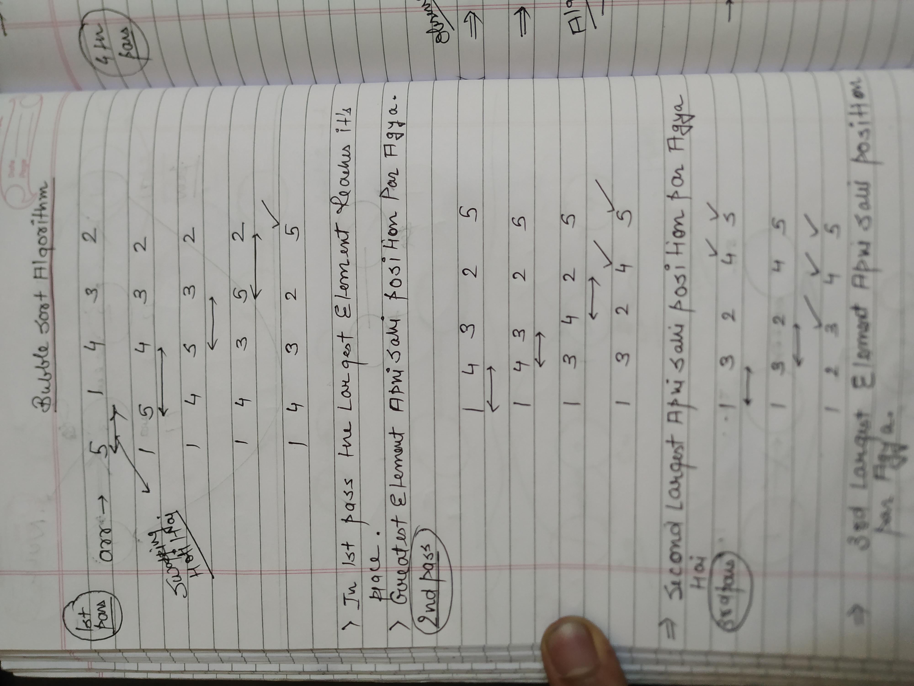
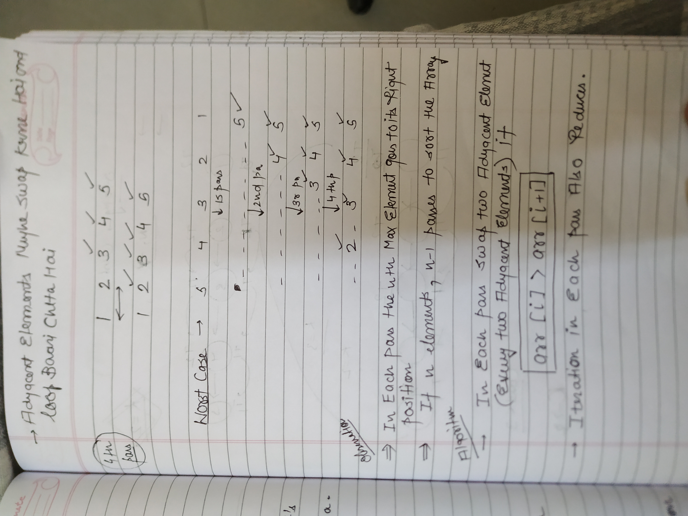

**YAHAN BASICALLY PASSES HOTE HAIN**

```C++
void bubbleSort(int arr[], int n) {
        // Your code here
        for(int i=1;i<n;i++){  // since i know n-1 passes honge pass 1->n-1
           bool sorted=true;   // Har bar check kar raha huon ki is pass mein agar kuch change
            for(int j=0;j<n-i;j++){ // nahi hua toh mtlb array sort ho chuka hai
                if(arr[j]>arr[j+1]){
                   swap(arr[j],arr[j+1]);
                   sorted=false;
                }
            }
            if(sorted)break;
        }
    }
```


TOTAL NUMBER OF OPERATIONS IN BUBBLE SORT IS N(N-1)/2;