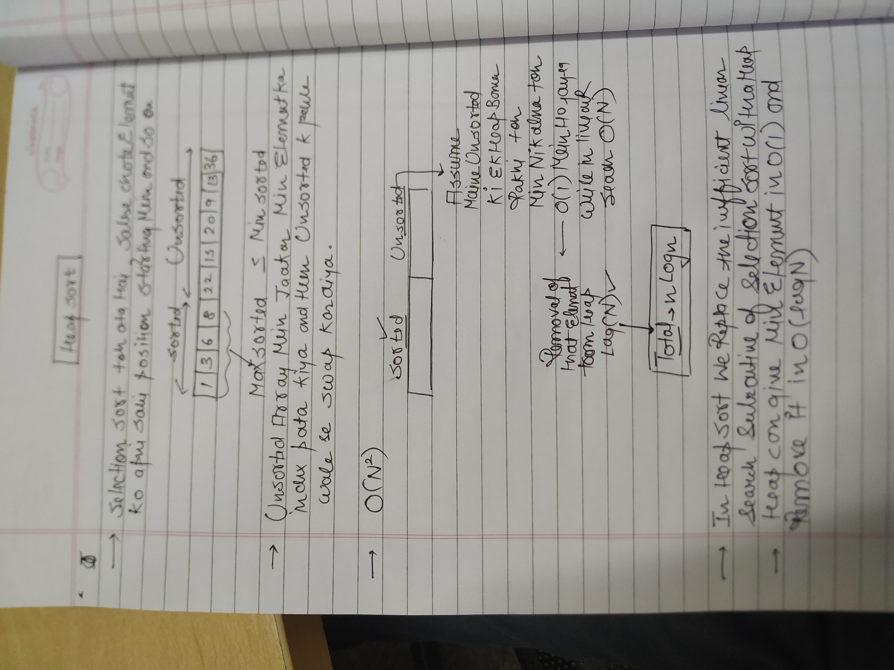
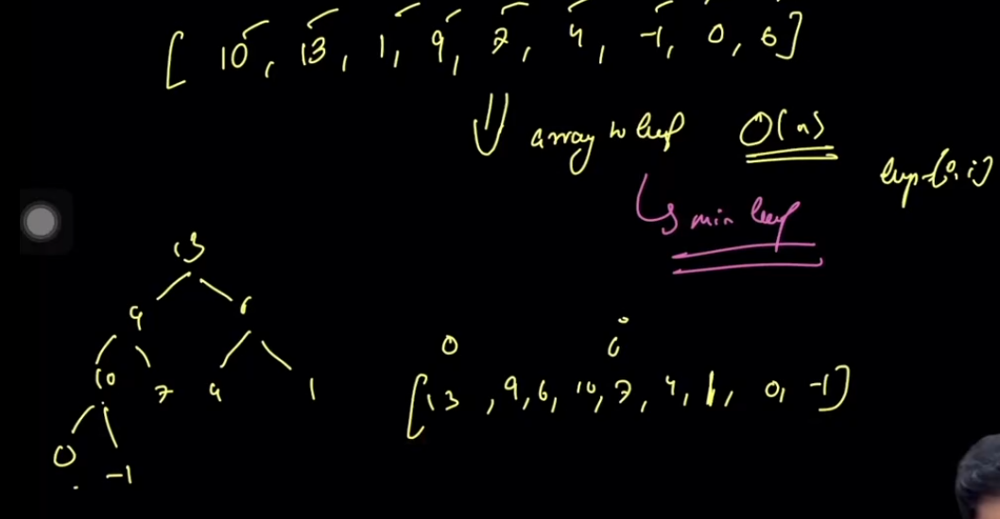

→ To sort In place without using any extra space we are going to use j pointer!

→In case if we’re going to use minheap in inplace heap sort implementation then we’d have to reverse the array/vector in the end!

→ If we use maxheap in that case we won’t have reverse the whole array!

→ Since given array ko hum pehle heap mein convert kar rahe hain and then we’re apply heapsort onto it , So isko Space complexity is O(1) and Time Complexity is O(Nlogn)