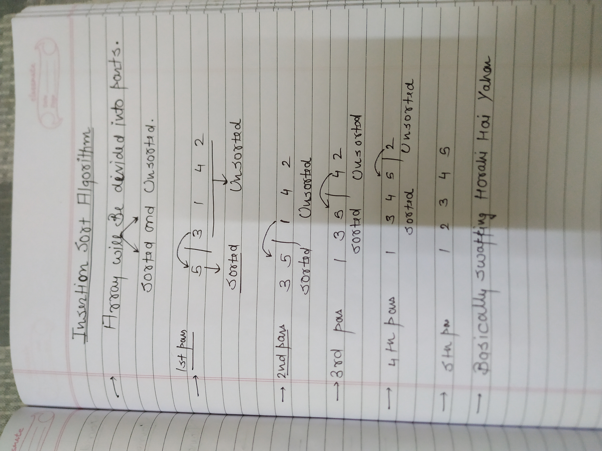

  



  

My Code→

```C++
 void insertionSort(int arr[], int n)
    {
        //code here
        for(int i=1;i<n;i++){
             for(int j=i;j>=1;j--){
                if(arr[j]<arr[j-1]){
                    int a=arr[j];
                    arr[j]=arr[j-1];
                    arr[j-1]=a;
                }else{
                    break;
                }
            }
        }
    }
```

BETTER CODE→


**STABLE HOTA HAI YE**