HOW CAN I MERGE TWO SORTED ARRAY INTO ONE BIG SORTED ARRAY??

[https://leetcode.com/problems/merge-sorted-array/description/](https://leetcode.com/problems/merge-sorted-array/description/)

CHUTIYA CODE→

```C++
 void merge(vector<int>& nums1, int m, vector<int>& nums2, int n) {
        vector<int>res(n+m);
        int i=0;
        int j=0;
        int k=0;
        while(i<m&&j<n){
            if(nums1[i]<=nums2[j]){
                res[k++]=nums1[i++];
            }else{
                res[k++]=nums2[j++];
            }
        }
        if(i==m){
            while(j<n){
                res[k++]=nums2[j++];
            }
        }else{
             while(i<m){
                res[k++]=nums1[i++];
            }
        }
       nums1=res;
    }
```

→This approach works, but it involves an extra space complexity of O(m+n) because of the additional vector.

### Possible Improvements

1. **In-Place Merge**:  
    If you want to avoid extra space, you can perform the merge in place. Assuming  
    `nums1` has enough space to accommodate elements from `nums2`
2. TC→ O(M+N) but SC →O(1)

OPTIMISED CODE →

→IN CASE AGAR NUMS1 PEHLE KHATAM HOJATA HAI TOH IN THAT CASE MUJHE NUMS2 KO COPY KARNA PADEGA

→ IN CASE NUMS2 PEHLE KHATAM HOJATA HAI TOH NUMS 1 TOH PEHLE SE HI SORTED THAT KOI DIKKAT THODI NA HOGI FIR

```C++
// CASE 1
void merge(vector<int>& nums1, int m, vector<int>& nums2, int n) {
        int i=m-1;
        int j=n-1;
        int k=n+m-1;

        while(i>=0&&j>=0){
            if(nums1[i]>=nums2[j]){
                nums1[k--]=nums1[i--];
            }else{
                nums1[k--]=nums2[j--];
            }
        }
        if(j>=0){
            while(j>=0){
                nums1[k--]=nums2[j--];
            }
        }
    }
```

```C++
//CASE 2
void merge(vector < int > & a,int n,vector < int > & b,int m,vector < int > & arr){
    int i=n-1;
    int j=m-1;
    int k=n+m-1;
    while(i>=0&&j>=0){
        if(a[i]>=b[j]){
            arr[k--]=a[i--];
        }else{
            arr[k--]=b[j--];
        }
    }
    if(j>=0){
        while(j>=0){
            arr[k--]=b[j--];
        }
    }
    if (i >= 0) {  // ye case mat bhulna
    while (i >= 0) {  
        arr[k--] = a[i--];
    }
}
}
void mergeSort(vector < int > & arr, int n) {
    // Write your code here.
    if(n==1)return;
    int size1=n/2;
    int size2=n-size1;
    vector<int>a(size1);
    vector<int>b(size2);
    for(int i=0;i<size1;i++){
        a[i]=arr[i];
    }
    for(int i=0;i<size2;i++){
        b[i]=arr[i+size1];
    }
    mergeSort(a,size1);
    mergeSort(b,size2);
    merge(a,size1,b,size2,arr);
    
}
```

→ NOW WE USE THIS MERGE FUNCTION IN MERGE SORT

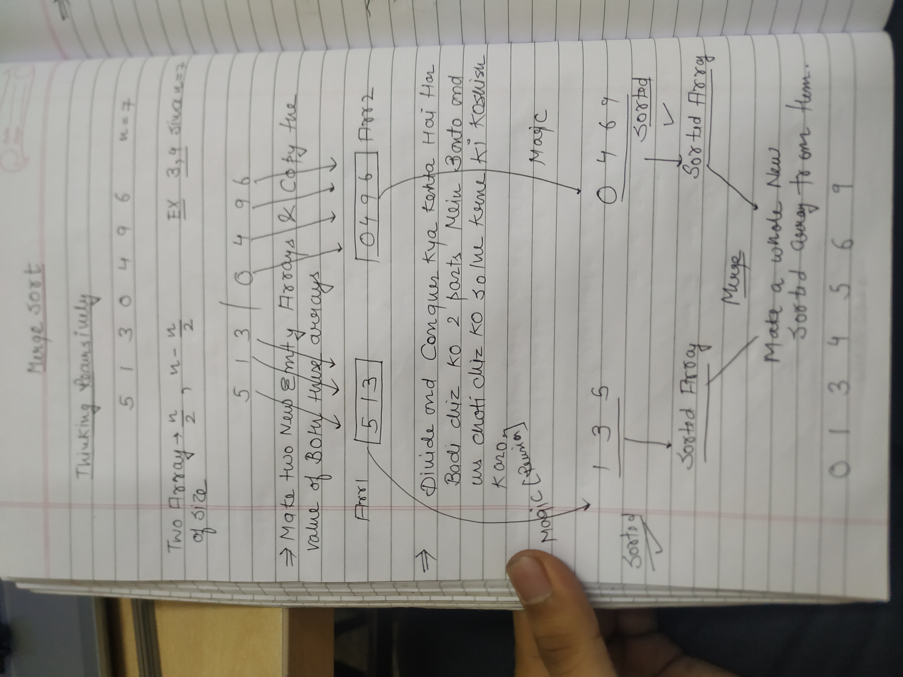

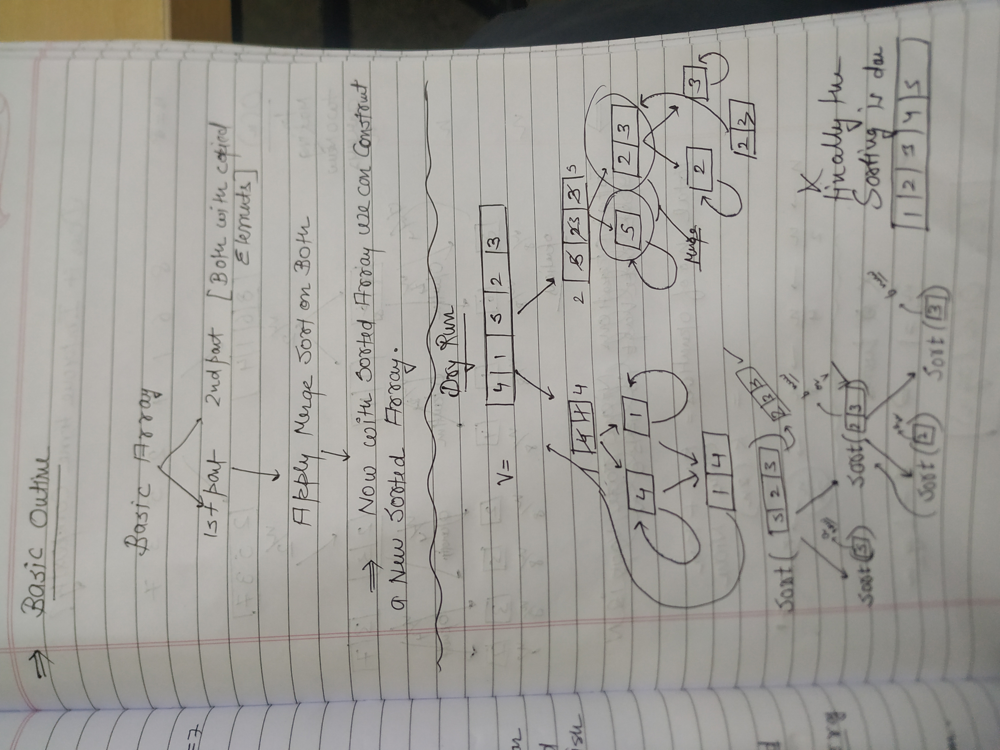

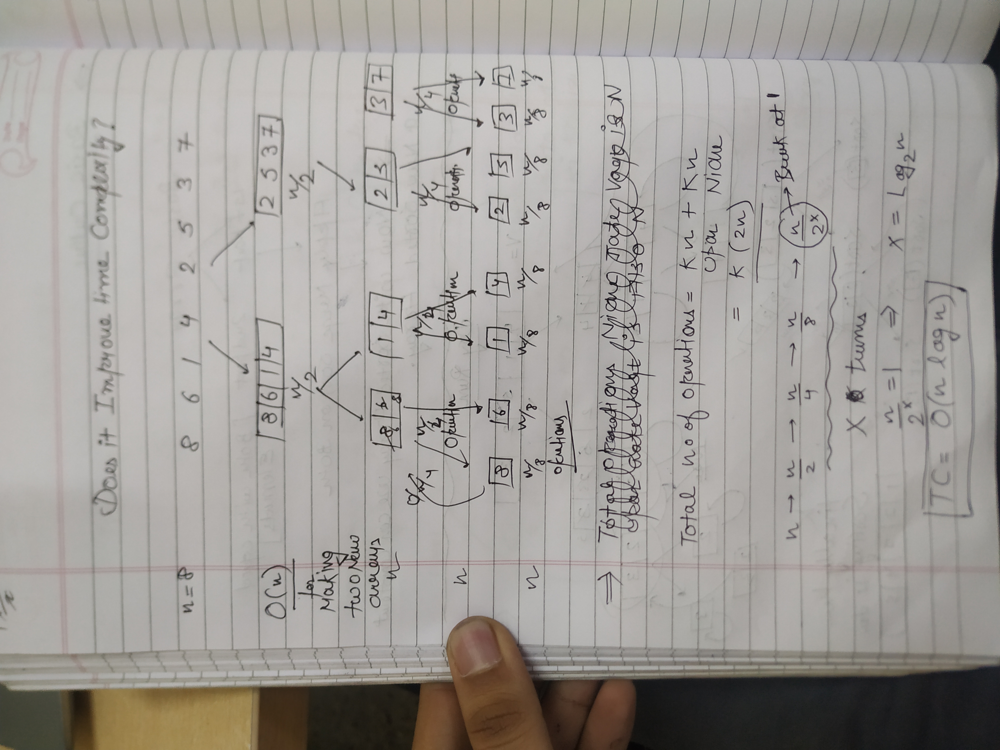

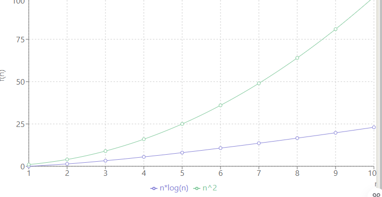

SO IN CASE OF N VALUES LIKE 1-10 Purani algorithms bhi kam krti hai

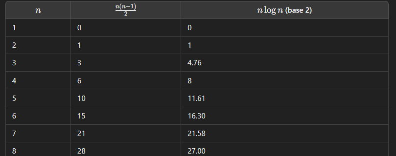

BUBBLE SORT MERGE SORT

⇒Yes, merge sort is a stable sorting algorithm. Stability in sorting algorithms means that if two elements have equal keys (or values), their relative order is preserved in the sorted output as it was in the input.

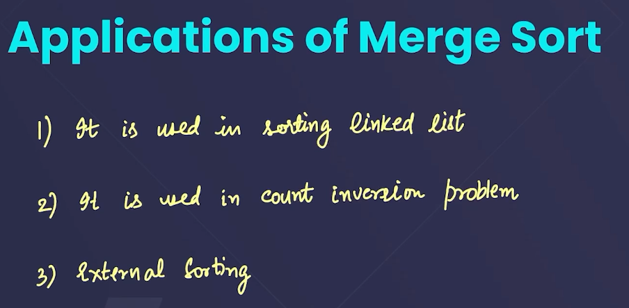

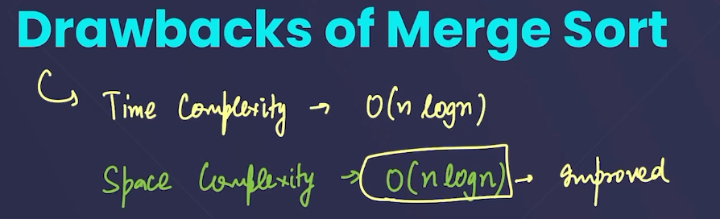

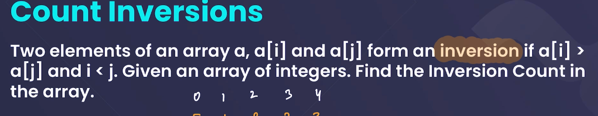

YE SAWAL ACHA HAI BHAI YE REVISE KARNA HAI

  

  

---

STRIVER - MERGE SORT

HYPOTHETICALLY DIVIDE THE ARRAY IN TWO PARTS USING LOW AND HIGH

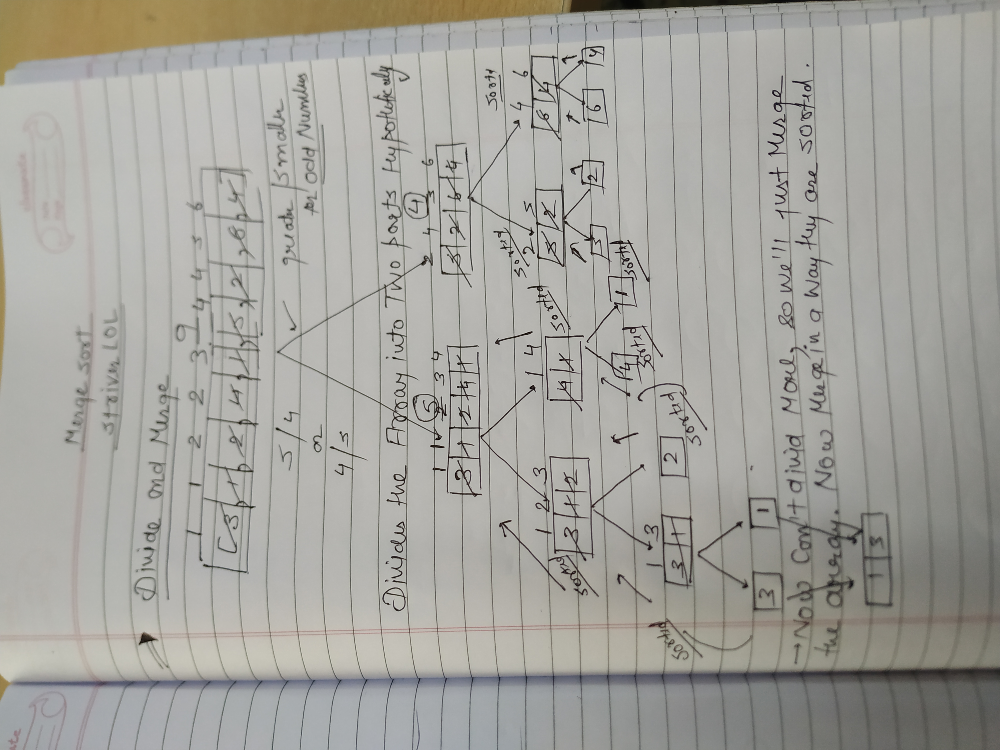

**→Now Obviously I won’t make new arrays all the time!! SO THAT’S WHY WE’LL PLAY WITH THE INDEXES HERE**

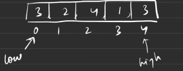

→ low means the starting point of the hypothetical array

→ High means the ending point of the hypothetical array

→

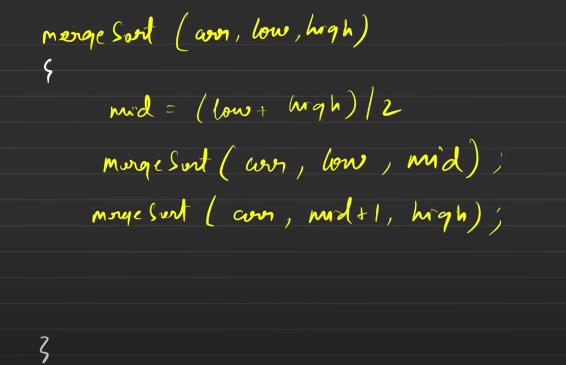

→ Instead of making a new array I’m just passing the indexes!

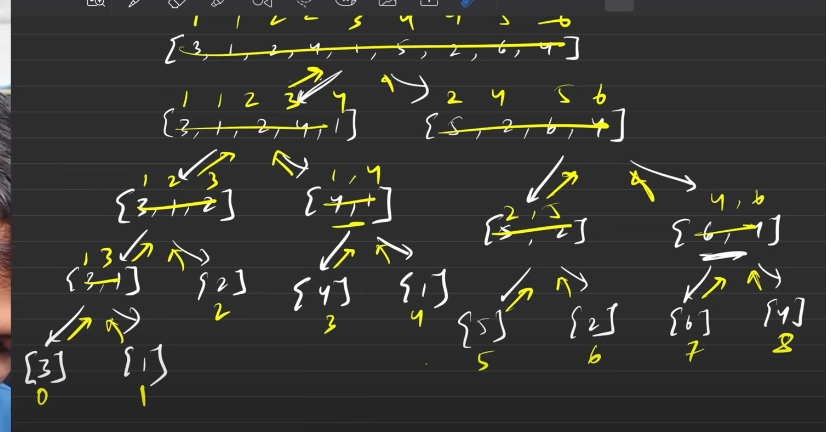

AGAR DEKHE IN TERMS OF THE EULERS TREE

→ HAR INDEX PAR GAYE HAIN HUM

→ 0 bhi 1 bhi 2 ….

→Backtrack karte vaqt sab kuch sort hojara hai

→PSEDO CODE

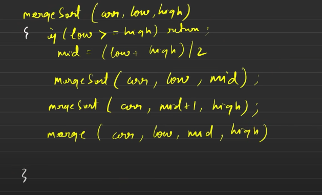

→DRY RUN

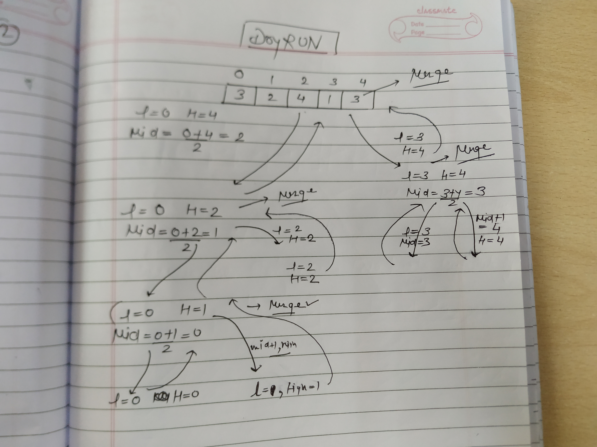

→ Now Let’s talk about the merge function

→CODE

```C++
public:
    void merge(int arr[], int l, int mid, int r)
    {
         // Your code here
         vector<int>res;
         int i=l;
         int j=mid+1;
         while(i<=mid&&j<=r){
             if(arr[i]<=arr[j]){
                 res.push_back(arr[i++]);
             }else{
                 res.push_back(arr[j++]);
             }
         }
     
             while(j<=r){
                 res.push_back(arr[j++]);
             }
     
             while(i<=mid){
                 res.push_back(arr[i++]);
             }
         
          for(int i=l;i<=r;i++){// sort toh humne l se r hu kiya hai na bhai& sorted ka result
              arr[i]=res[i-l];  // res mein tha har bar res new create hua hai res toh 0 se start
          }                     // res 0 se hi start hoga
         
    }
    public:
    void mergeSort(int arr[], int l, int r)
    {
        //code here
        if(l>=r)return;  // ek element kab hoga since // L to r ek range hai and in case wo dono 
        int mid=(l+r)/2; // same hogaye toh fir sirf ek hi element hai range mein and wo hi 
                         // base condition hogi
        mergeSort(arr,l,mid);
        mergeSort(arr,mid+1,r);
        merge(arr,l,mid,r); // it kinda makes sense to use mid use here since we've sorted arrays
    }                       //  l to mid is is sorted and also mid+1 to r is also sorted
};                          // merge function ko batana bhi toh padega hi kin kin ko sort krna hai
```

**Time complexity: O(nlogn)**

**Reason: At each step, we divide the whole array, for that logn and we assume n steps are taken to get sorted array, so overall time complexity will be nlogn**

**Space complexity: O(n)**

**Reason: We are using a temporary array to store elements in sorted order.**

**Auxiliary Space Complexity: O(n)**