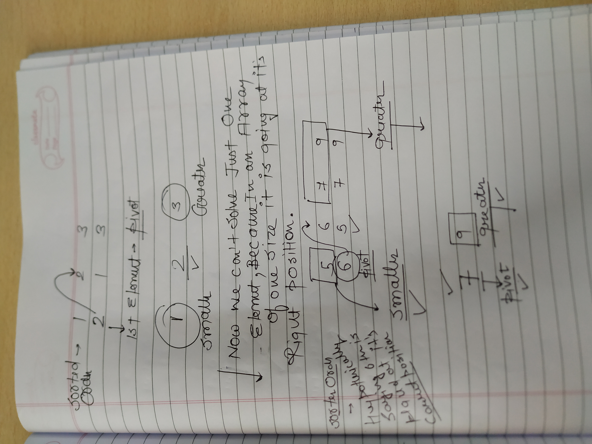

MAIN FAYDA KYA HAI QUICK SORT KA??

**→Well Merge Sort ki space complexity is going to be equal to O(N) and The Space complexity of Quick Sort is going to be O(1)**

→




→ we’re not going to use Space here. We’re just going to use the concept of low and High Hee

→


→ PSEUDO CODE


### Purpose of the Partition Function

The `partition` function is used to rearrange the elements of the array so that all elements less than a chosen value (called the "pivot") are placed to its left, and all elements greater than the pivot are placed to its right. It then returns the index where the pivot element ends up after this rearrangement.

CODE→

```C++
int partition(vector<int> &arr, int low, int high) {
    int pivot = arr[low];
    int i = low;
    int j = high;

    while (i < j) {
        while (arr[i] <= pivot && i <= high - 1) {
            i++;
        }

        while (arr[j] > pivot && j >= low + 1) {
            j--;
        }
        if (i < j) swap(arr[i], arr[j]);
    }
    swap(arr[low], arr[j]);
    return j;
}

void qs(vector<int> &arr, int low, int high) {
    if (low < high) {
        int pIndex = partition(arr, low, high);
        qs(arr, low, pIndex - 1);
        qs(arr, pIndex + 1, high);
    }
}
```