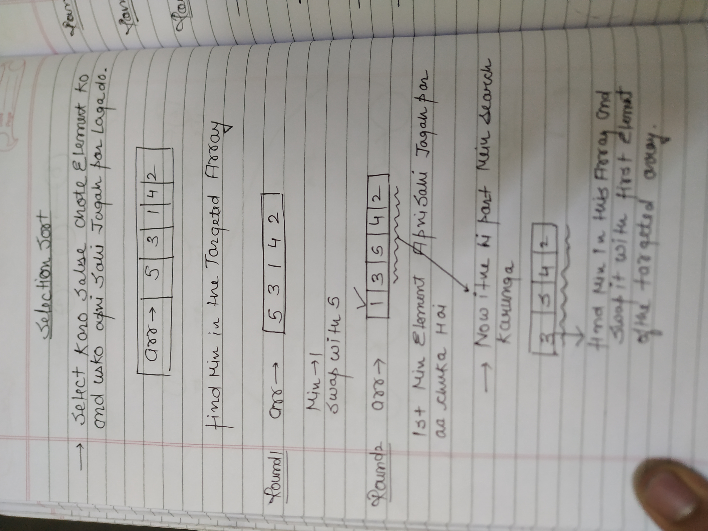

⇒ IF WE’VE T FIND THE FIRST 2 MIN ELEMENTS TOH THODA BUHUT ISKA IDEA ANA CHAHIYE DIMAG MEIN

  

  

```C++
void selectionSort(int arr[], int n)
    {
       //code here
       for(int i=0;i<n-1;i++){  // ith inded k liye we find the smallest value
           int minidx=i;
           for(int j=i+1;j<n;j++){
               if(arr[j]<arr[minidx]){
                   minidx=j;
               }
           }
           if(i!=minidx) swap(arr[i],arr[minidx]);
       }
    }
```