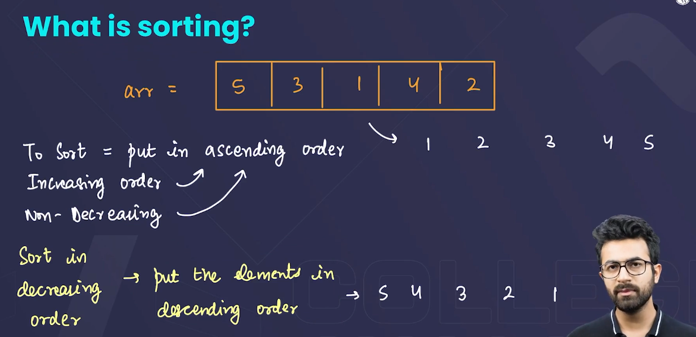

⇒ STL SORTING ALGO⇒TC= O(nlogn)

  

→ AGAR NAYE ARRAY CREATE NAHI KRNE HUMEIN TOH HUMEIN INDEX CHAHIYE HOTE HAIN SAID IN RELATION TO MERGE SORT AND QUICK SORT

→In C++, you can use the `std::sort` function, which is part of the `<algorithm>` library. By default, it sorts in ascending order.

TO SORT IT IN ASCENDING ORDER

```C++
sort(numbers.begin(), numbers.end()); 
```

TO SORT IT IN DESCENDING ORDER

```C++
sort(numbers.begin(), numbers.end(), greater<int>());
```

### Sorting Process with Custom Comparator

**Sorting Algorithm**: The C++ Standard Library's `std::sort` uses a variant of the **IntroSort** algorithm, which is a hybrid sorting algorithm combining QuickSort, HeapSort, and InsertionSort. The key point is that `std::sort` relies on comparisons between elements to determine their order.

  

  

  

