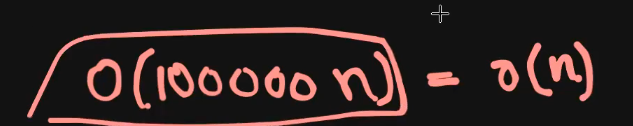

What is constant Time??

→All These operations will take Same amount of time!

→Elementary operations are not dependent on the size!

→Chahe Multiply karo 19 _13 ya 19282_8*290280 They Both will result in the same!

The Time 10^8 might fluctuate a lil bit!

→When we compare Two Strings, Dono String k starting checking chalu hogi and jabh pehle different character milega toh hum check karlenege lexicographically and in case s1[i] is smaller than s2[i] then we can just return true and vice versa!  
  

IF BOTHB STRINGS ARE SAME IT WILL RETURN FALSE!

YE BUT ELEMENTARY OPERTAION NAHI HAI!

→KYONKI SIZE TOH DEPEND KAREGA HI NA! KISKA BHAI STRING KA?? AGAR STRING KA SIZE DIFFRENT HUA TOH FIR VAPIS DIFFERNET OPERATIONS HONGE

→ primitive datatypes k operation Constant time mein hojate hain! But secondary or derived datatypes k operations mein time lagta hai!

→ Agar kisi ka datatype int hai jaise toh usko lagegi 32 bits right! And ab number chahe 87 ho ha 387389 usee farak nahi padta lagegi toh 32 bits hi na!

→Strings can store almost infinte number of charaters as long as your computer have enough memory

→

→

→ TAKING INPUT OF A STRING IS NOT ELEMENTARY BUT TAKING INPUT OF INTEGER IS ELEMENTARY!

Example mein ye bataya hai ki!

→if X is number of operations then total number of operations is 10^9+3 and since we know for 10^8 operations my machine takes around 1 second then the above operations will be done in 10 seconds!

  

Pretty Much the same!

Now in this We can’t ignore n^2 since looking at the constrainsts!

We can see that!

Programming mein log ka base generally 2 hi hota hai!

  

Here The constant factor does matters!

Example→

Now total Would be around O(10^9)→ TLE MARDEGA YE

T → TEST CASES HAIN!

  

→

