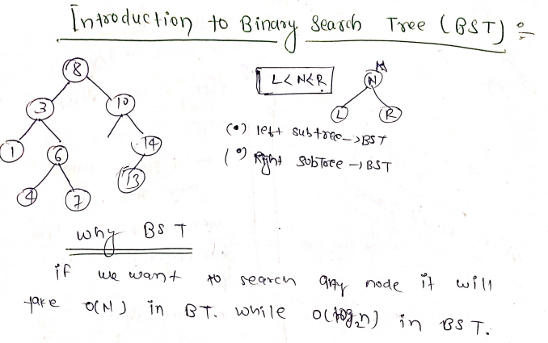
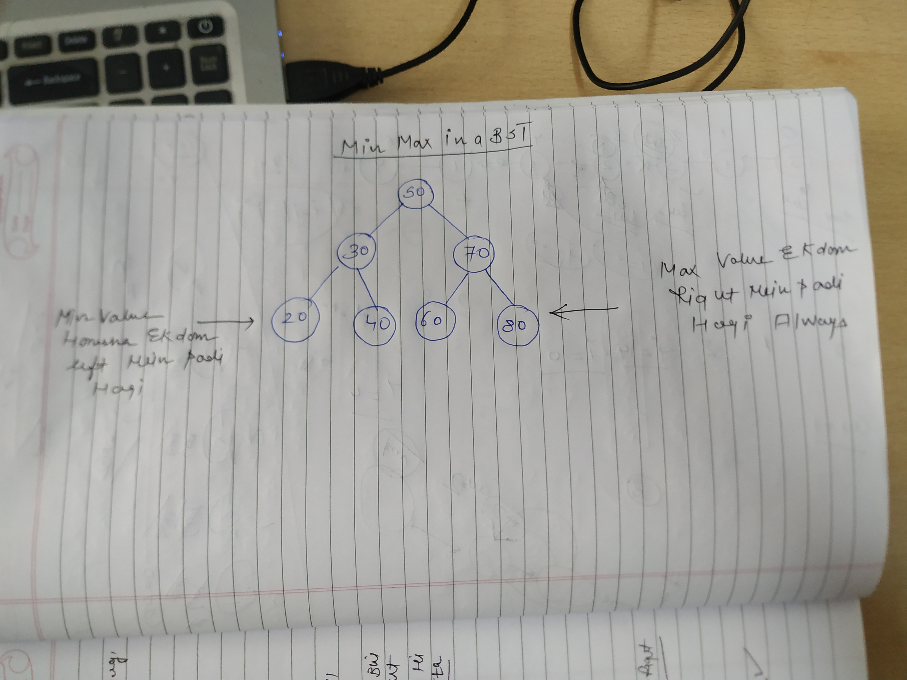
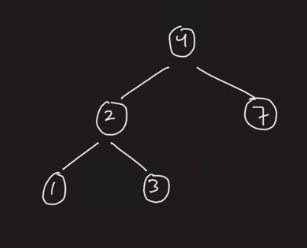
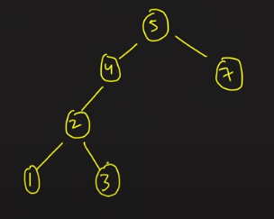
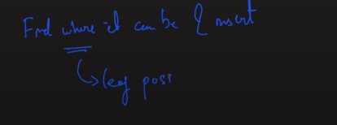
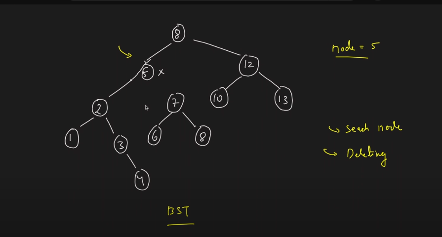
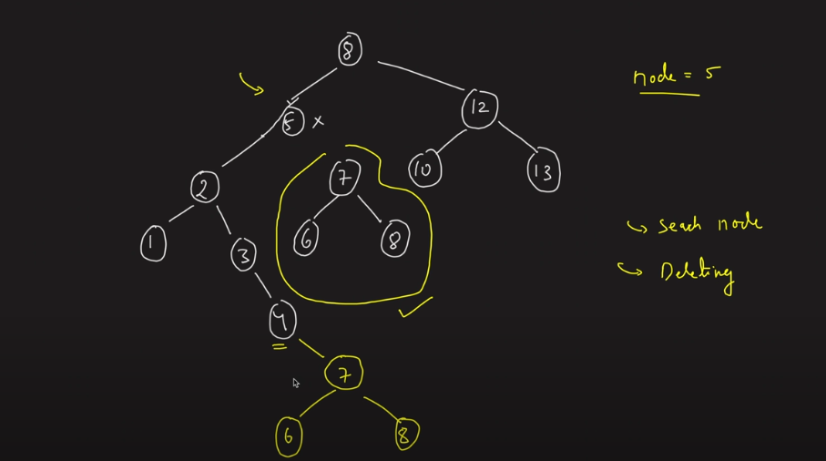
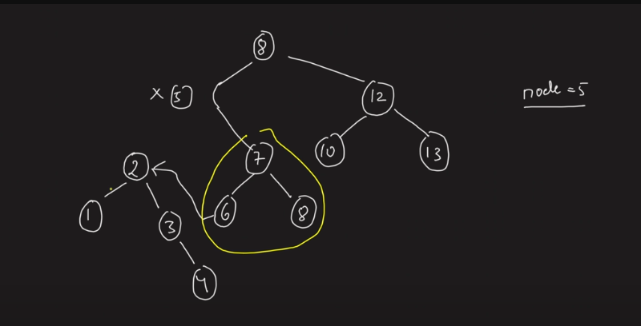
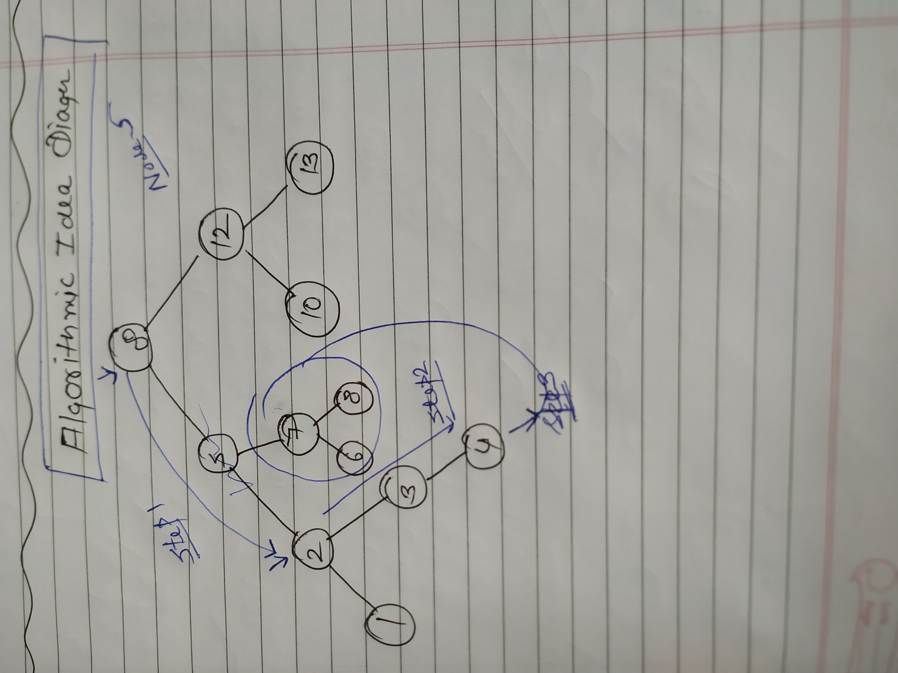
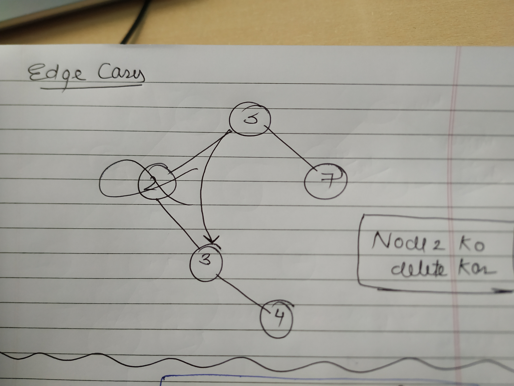

-  L<N<R is mostly with no duplicates!
-  Everything on the left should be lesser than the node's value and everything on the right should be greater than the node's value!

-  If duplicates exist We’d have to take the Equal Marks! like L< = N< = R
- How to integrate these nodes well what you can do is either add a node to the tree or like just keep a counter variable in the node like if 8 comes twice (8,2)


→BST mein Right wale part mein sare nodes bade honge root se and left wale sare chote honge root se!

→ SO TO BE BST , ON EVERY NODE THE BST PROPERTY SHOULD BE FOLLOWED MEANING THAT HAR SUBTREE SHOULD BE A BST ONLY THEN YOU CAN SAY THE WHOLE TREE IS A BST!


## **WHY BST??**
Height of the BST is generally  log2(N)

## **SEARCH IN A BST**


In a **Binary Search Tree (BST)**:

- The **maximum value** will always be found in the **rightmost node** of the tree because, by definition, all values in the right subtree are greater than the current node.
- The **minimum value** will always be found in the **leftmost node** of the tree because all values in the left subtree are smaller than the current node.

  



### SEARCH IN BST

[https://www.geeksforgeeks.org/problems/search-a-node-in-bst/1?itm_source=geeksforgeeks&itm_medium=article&itm_campaign=practice_card](https://www.geeksforgeeks.org/problems/search-a-node-in-bst/1?itm_source=geeksforgeeks&itm_medium=article&itm_campaign=practice_card)

RECURSIVE
```c++
TreeNode* searchBST(TreeNode* root, int val) {
        if(!root) return NULL;
        if(root->val == val){
            return root;
        } else if(root->val > val){
             return searchBST(root->left,val);
        }else{
            return searchBST(root->right,val);
        }
    }
```

Time Complexity: O(N)
Space Complexity: O(log2N)

ITERATIVELY EASY HOTA HAI!
TC: log2(N) ati hai!
```C++
bool search(Node* root, int x) {
    // Your code here
    while(root && root->data!=x){
        root = (root->data>x) ? root->left : root->right;
    }
    if(root)return true;
    return false;
}

```


In a **Binary Search Tree (BST)**, the snippet `while(root && root->val != val)` works perfectly for searching because of the specific properties of a BST:

1. **Ordered structure**:
    
    - In a BST, the left child of a node always contains values smaller than the node, and the right child contains values larger than the node. This order allows you to discard one half of the tree at each step based on whether the value you're searching for is less than or greater than the current node's value.
    - You can efficiently "narrow down" your search by following the structure of the tree, moving either left or right as appropriate, just like in binary search.
    
    Hence, this iterative approach works for a **BST** because it leverages the fact that you know where to search next: either the left or right subtree, depending on the comparison.
    

### Why this doesn't work for a generic **Binary Tree**:

A **Binary Tree**, on the other hand, does **not** have the ordering properties of a BST. In a generic binary tree:

- The left and right children can have any arbitrary value, without any relationship to the parent node.
- There's no guarantee that smaller values will be on the left and larger values on the right.

Time Complexity!

- **BST:** Takes advantage of ordering, providing better performance on average (O(log N)).
- **BT:** Has no ordering, leading to linear time complexity (O(N)) in the worst case for all searches.

  

**Binary Search Tree (BST)** can become a **skewed tree**.

### What is a Skewed Tree?

A **skewed tree** is a type of binary tree in which all the nodes have only one child, either on the left or the right. There are two types of skewed trees:

- **Left-Skewed Tree:** Each node has only a left child.
- **Right-Skewed Tree:** Each node has only a right child.

### How Can a BST Become Skewed?

A BST can become **skewed** if the values are inserted in either increasing or decreasing order.

1. **Right-Skewed BST:**
    
    - If the elements are inserted in **increasing order**, each new element is greater than the previous one. As a result, all elements will be inserted as right children, leading to a **right-skewed tree**.
    
    Example of inserting elements in increasing order:
    
    ```YAML
    
    Insert: 1, 2, 3, 4, 5
    Resulting BST:
        1
<br/>
          2
<br/>
            3
<br/>
              4
<br/>
                5
    
    ```
    
2. **Left-Skewed BST:**
    
    - If the elements are inserted in **decreasing order**, each new element is smaller than the previous one. As a result, all elements will be inserted as left children, leading to a **left-skewed tree**.
    
    Example of inserting elements in decreasing order:
    
    ```YAML
    
    Insert: 5, 4, 3, 2, 1
    Resulting BST:
        5
       /
      4
     /
    3
    ```
    

**WELL IN THIS CASE EVE SEARCHING IN BST WILL ALSO COME UNDER O(N)**

**FIND MIN AND MAX VALUE IN A TREE**
https://www.geeksforgeeks.org/problems/minimum-element-in-bst/1

## **MIN**
```c++
 int minValue(Node* root) {
        // Code here
        while(root->left!=NULL){
            root=root->left;
        }
        return root->data;
    }
```
Time Complexity: O(log2N)
Space Complexity: O(1)

## **MAX** 
```c++
 int maxValue(Node* root) {
        // Code here
        while(root->right!=NULL){
            root=root->right;
        }
        return root->data;
    }
```

Time Complexity: O(log2N)
Space Complexity: O(1)


**Ceil(X) is a number that is either equal to X or is immediately greater than X.**
[https://www.geeksforgeeks.org/problems/implementing-ceil-in-bst/1](https://www.geeksforgeeks.org/problems/implementing-ceil-in-bst/1)

```C++
int findCeil(Node* root, int i) {
    if (root == NULL) return -1;

    // Your code here
    int ceil=-1;
    while(root){
        if(root->data>=i){
            ceil=root->data;
            root=root->left;
        }
        root=root->right;
    }
    return ceil;
}
```

[https://www.geeksforgeeks.org/problems/floor-in-bst/1](https://www.geeksforgeeks.org/problems/floor-in-bst/1)

```C++
int floor(Node* root, int x) {
        // Code here
        int floor=-1;
        if(!root)return floor;
        while(root){
            if(root->data <= x){
                floor=root->data;
                root=root->right;
            }
            root=root->left;
        }
        return floor;
    }
```

[https://leetcode.com/problems/insert-into-a-binary-search-tree/description/](https://leetcode.com/problems/insert-into-a-binary-search-tree/description/)



Ismein 5 insert karna hai!

```C++
       4
      / \
     2   7
    / \  /
   1   3 5
```

```C++
       4
      / \
     2   5
    / \   \
   1   3   7
```





### 1. **Recursive Approach** (First Code):

```C++
cpp
Copy code
TreeNode* insertIntoBST(TreeNode* root, int val) {
    if (root == NULL) return new TreeNode(val);

    if (root->val > val) {
        root->left = insertIntoBST(root->left, val);
    } else {
        root->right = insertIntoBST(root->right, val);
    }
    return root;
}
```

### 2. **Iterative Approach** (Second Code):

```C++
cpp
Copy code
TreeNode* insertIntoBST(TreeNode* root, int val) {
    if (root == NULL) return new TreeNode(val);
    TreeNode* temp = root;
    while (temp) {
        if (temp->val > val) {
            if (temp->left) {
                temp = temp->left;
            } else {
                temp->left = new TreeNode(val);
                break;
            }
        } else {
            if (temp->right) {
                temp = temp->right;
            } else {
                temp->right = new TreeNode(val);
                break;
            }
        }
    }
    return root;
}
```

### 3. **Iterative Approach with** `**prev**` **Pointer** (Third Code):

```C++
cpp
Copy code
TreeNode* insertIntoBST(TreeNode* root, int val) {
    TreeNode* t = new TreeNode(val);
    if (root == NULL) return t;
    TreeNode* temp = root;
    TreeNode* prev = NULL;
    while (temp != NULL) {
        prev = temp;
        if (temp->val > val) {
            temp = temp->left;
        } else {
            temp = temp->right;
        }
    }
    if (prev->val > val) {
        prev->left = t;
    } else {
        prev->right = t;
    }
    return root;
}
```

### Comparison:

- **First Code (Recursive)**: Simple and clean, but recursion may cause issues with deep trees (stack overflow).
- **Second Code (Iterative)**: Avoids recursion but uses a loop to traverse. It's slightly more verbose but safer in terms of memory (no stack overflow).
- **Third Code (Iterative with** `**prev**`**)**: This method is a variation of the iterative approach but uses a `prev` pointer to track the parent node, offering flexibility in handling more complex scenarios. However, it's a bit more complicated than the second version.

  

[https://leetcode.com/problems/delete-node-in-a-bst/](https://leetcode.com/problems/delete-node-in-a-bst/)(REVISE)

Now even deleting a node can also result in various Types of Trees not just one!







EDGE CASES HONGE LEKIN



