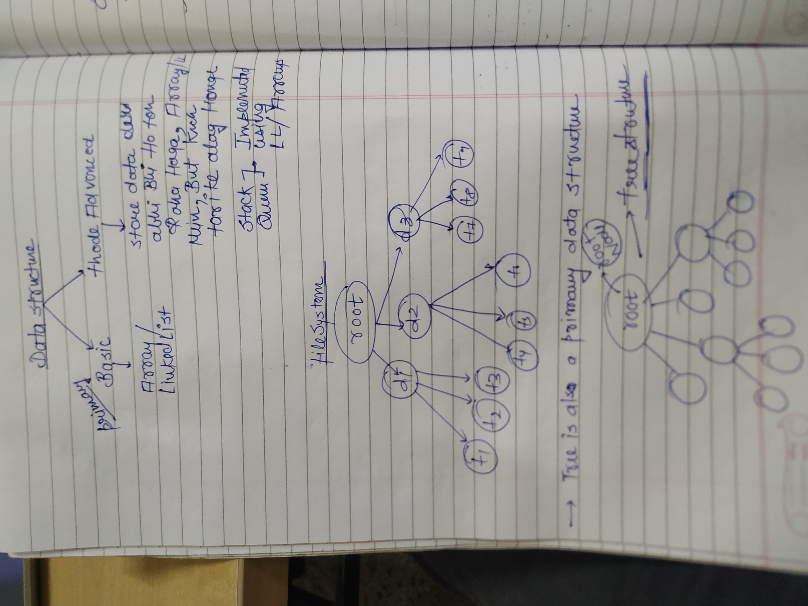

  
A  
**tree** is a hierarchical data structure consisting of nodes connected by edges. Trees are widely used in algorithms and data structures to represent hierarchical data, such as file systems, organizational structures, etc.

- **Node**: A node contains a value or data and references to its children (in most cases).
- **Root**: The top node in the tree. Every tree must have one root node.
- **Parent and Child**: If node `A` is connected to node `B`, then `A` is the parent of `B`, and `B` is the child of `A`.
- **Leaf**: A node without children.
- **Height of the Tree**: The number of edges from the root to the farthest leaf.
- **Depth of a Node**: The number of edges from the root to that node.

  

```C++
class TreeNode {
public:
    int data; // The value/data in the node// type can be different
    vector<TreeNode*> children; // Vector to hold the children of the node

    TreeNode(int val) {
        data = val;
    }

    void addChild(TreeNode* child) {
        children.push_back(child);
    }
};
```

⇒In most of the Tree Problems We Kinda Recursion only!

⇒While Traversing in a generic Tree We don’t have to explicitly Write the base case might have to add the edge case!

→KUCH JADA TOUGH HAI NAHI ISMEIN

→ CHILDREN VECTOR PAR SWAL BNTE HAI MOSTLY