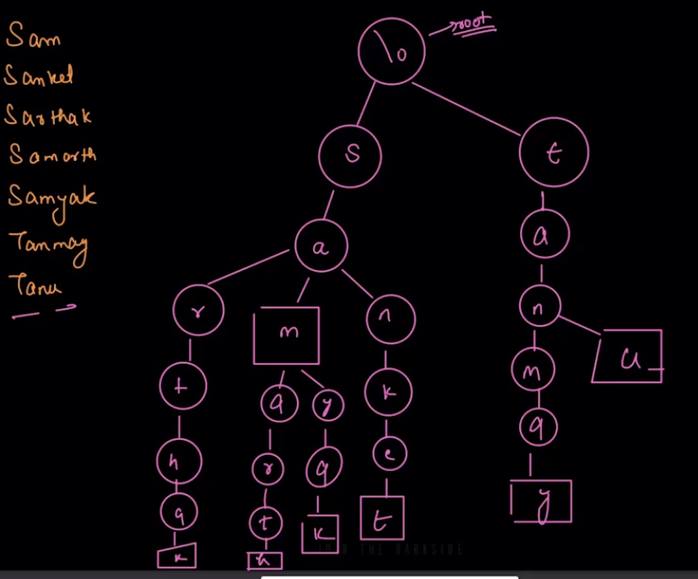
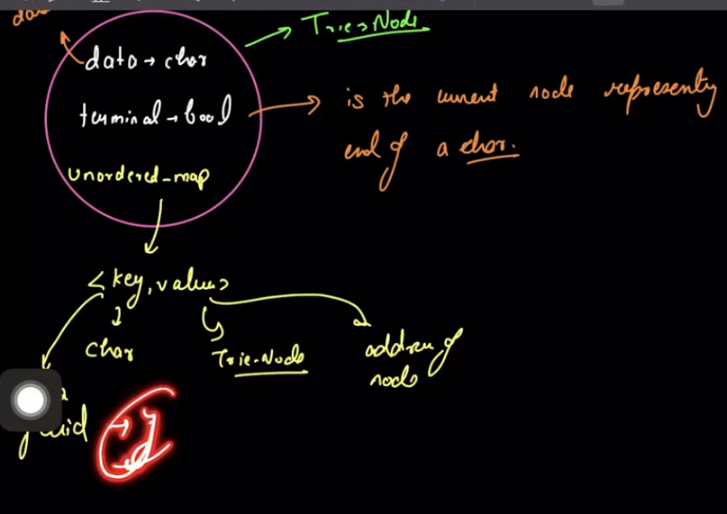

### Problem Statement: Storing and Searching Bookmarks using Prefix

### Part 1: Storing Bookmarks

Design a system to store a list of website bookmarks. Each bookmark has a URL associated with it. The goal is to allow efficient prefix-based search for bookmarks, such that users can retrieve all bookmarks that start with a specific prefix of the URL.

### Part 2: Searching Bookmarks using a Prefix

Implement a feature that allows users to type a prefix (partial URL) and retrieve all bookmarks whose URLs begin with that prefix.

### Example:

1. **Bookmarks**:
    - `https://openai.com`
    - `https://openai/t.com`
    - `https://openai/arr.com`
    - `https://google.com`
    - `https://github.com`
    - `https://gitlab.com`
    - `https://gmail.com`
    
2. **Prefix Search**:
    - Input: `"git"`
    - Output:
        - `https://github.com`
        - `https://gitlab.com`
    - Input: `"https://g"`
    - Output:
        - `https://google.com`
        - `https://github.com`
        - `https://gitlab.com`
        - `https://gmail.com`

### Problem Statement: Storing and Searching Contacts using Prefix

### Part 1: Storing Contacts

Design a system to store contact names and phone numbers. The goal is to allow users to retrieve a list of contacts whose names start with a given prefix. The system should handle efficiently adding, searching, and retrieving contacts.

### Part 2: Searching Contacts using a Prefix

Implement a feature that allows users to search for contacts by typing the prefix of a contact's name and retrieve all contacts whose names start with that prefix.

### Example:

1. **Contacts**:
    - `Alice: +1234567890`
    - `Alex: +9876543210`
    - `Bob: +5647382910`
    - `Charlie: +1112223333`
2. **Prefix Search**:
    - Input: `"Al"`
    - Output:
        - `Alice: +1234567890`
        - `Alex: +9876543210`
    - Input: `"B"`
    - Output:
        - `Bob: +5647382910`

---

TRIE→ PREFIX DATA STRUCTURE / PREFIX TREE

TRIE SABSE PEHLE TOH EK DATA STRUCTURE HI HAI

